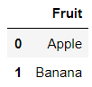
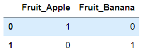
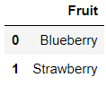
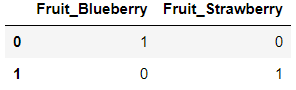
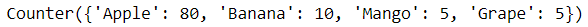
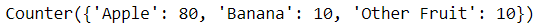
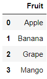
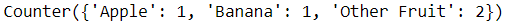

# Source: https://towardsdatascience.com/2-ways-to-build-your-own-custom-scikit-learn-transformers-a8aeefbf8bf8/

Data Science

# 2 Ways to Build Your Own Custom Scikit Learn Transformers

How you can (and why you should) create custom transformers

Aashish Nair

Oct 17, 2022

7 min read

Share

Photo by Eugen Str on Unsplash

Scikit Learn transformers (not to be confused with deep learning transformers) are classes in the Scikit Learn package that facilitate transformations in given datasets.

These transformers can carry out various operations like normalization and principal component analysis. However, certain situations may call for operations that may not be possible to execute with the provided tools.

For such cases, users may opt to create custom functions that meet their specific needs. However, there is a much better option available for machine learning applications: creating custom transformers.

Here, we explore the benefits of using custom transformers instead of custom functions in Scikit-Learn and go over 2 different ways users can create them.

---

### Why custom transformers (as opposed to functions)?

Scikit Learn transformers are designed to be efficient. They implement the `fit` method, which derives the required model parameters from the training set, and the `transform` method, which uses those model parameters to transform both the training and testing sets.

Furthermore, the Scikit Learn package provides classes like the Pipeline and the ColumnTransformer. Such tools go hand-in-hand with transformers and enable users to construct a neat and organized feature engineering procedure.

The main problem with custom functions is they can’t be incorporated into many of the aforementioned Scikit Learn tools. As a result, users will be forced to shoehorn these functions into their feature engineering procedure in a manner that is both inefficient and prone to error.

A much better option would be to execute custom operations with custom transformers. This will ensure that they can be used cohesively with other transformers with tools like the pipeline.

---

### Do you *really* need a custom transformer?

The next question to consider is if you even need a custom transformer in the first place. The Scikit Learn package may not have a transformer that you need, but that doesn’t necessarily mean that you’ll have to put in extra work to create your own transformer.

There are a number of open-source Python packages specializing in feature engineering that are compatible with Scikit Learn such as the feature\_engine and the category\_encoders packages. These packages provide their own set of transformers that may meet your needs.

So, before you even begin to contemplate writing any extra code, be thorough and explore all tools available to you. A little digging can save you a lot of trouble in the long run.

---

### Creating a custom transformer in Scikit-Learn

The notion of creating a transformer might seem daunting, but it requires little effort, thanks to the Scikit Learn packages’ tremendous features.

For those looking to build their own custom transformer, there are two main options available.

---

### Option 1 – Using the FunctionTransformer

The Scikit Learn module offers the FunctionTransformer class that, as the name suggests, converts functions into transformers. Moreover, the conversion is achieved with a simple one-liner!

The FunctionTransformer can be used to convert preexisting numpy or pandas functions into transformers.

It can also be used to transform custom functions into transformers. If the function of interest requires arguments, they can be inputted in the `kw_args` parameter.

For instance, if we wanted to create a transformer that multiplied all values by a given number, we can create a function that carries out the task and then convert it to a transformer.

Once the function is converted into a transformer, it possesses the `fit` and `transform` methods, which make it easy to use with other transformers.

That being said, the FunctionTransformer has a notable limitation.

Unfortunately, it doesn’t store the parameters used to fit the training data, which can be an issue for certain operations that require model parameters to be preserved, such as normalization and one hot encoding.

Since it might be difficult to conceptualize this flaw, using an example would be beneficial. We can perform one-hot-encoding on a dataset using a transformer created by converting the `pandas.get_dummies` function.

Suppose we had the following data.

Code Output (Created By Author)

We can convert the `get_dummies` function into a transformer and then use its `fit_transform` method to encode the data.

Code Output (Created By Author)

The output shows the columns ‘Fruit\_Apple’ and ‘Fruit\_Banana’. For the transformer to be viable, it would need to generate the same columns when processing unseen data.

However, is that the case with our transformer? How would it perform with the following dataset, which has unseen data?

Code Output (Created By Author)

Code Output (Created By Author)

The transformer now yields the columns ‘Fruit\_Blueberry’ and ‘Fruit\_Strawberry’, which do not match the output from the training set. That’s because the new columns are derived from the testing data as opposed to the training data.

On a side note, I discuss a solution to this dilemma in a separate article:

> **Why You Shouldn’t Use pandas.get\_dummies For Machine Learning**

All in all, the FunctionTransformer class serves as an easy way to convert functions into transformers, but it isn’t ideal for cases where the parameters from the training data have to be preserved.

### Option 2— Creating a Scikit Learn Transformer From Scratch

The second option would be to create a transformer from scratch. Once again, this prospect isn’t as challenging as it may seem.

The best way to illustrate the approach is with an example.

Suppose that we are building a transformer that addresses high cardinality (i.e., too many unique values) by converting minority categories into one specific category.

The transformer will utilize the following modules:

First, we can create the class named `ReplaceMinority`. To do so, we need to inherit the two imported base classes `BaseEstimator` and `TransformMixin`.

Then, we need to initialize the attributes with the `__init__` constructor. This transformer will have the `threshold` parameter, which states the minimum proportion of a non-minority category, and the `replace_with` parameter, which states the category that the minorities should be replaced with.

Next, we can create the `fit` method. For this application, we need to input the data and record all the non-minority categories for each column in the given data frame.

After that, we can create the `transform` method. Here is where we replace all minority categories with the argument in the `replace_with` parameter for each column and return the resulting dataset.

And that’s it!

When we put everything together, this is what the class looks like.

That didn’t take too much work, did it?

Let’s put the transformer to the test. Suppose we have a dataset of fruits, which has a few minority groups.

Code Output (Created By Author)

We can reduce the number of unique categories by replacing the minorities with ‘Other Fruit’ using this transformer.

Let’s create a `ReplaceMinority` object and then use the `fit_transform` method to replace the minorities with ‘Other Fruit’.

Code Output (Created By Author)

Here, the transformer has recognized ‘Apple’ and ‘Banana’ as the non-minorities. All other fruits were replaced with ‘Other Fruit’. This results in a decrease in the number of unique values.

The transformer will now process any unseen data based on the parameters in the training data. We can demonstrate this by transforming a test set data:

Code Output (Created By Author)

Within the test set alone, *none* of the categories are minorities, but the transformer has recognized ‘Apple’ and ‘Banana’ as the only non-minority categories, so any other category will be replaced with ‘Other Fruit’.

Code Output (Created By Author)

Furthermore, we can embed the new transformer into Scikit Learn pipelines. Here, we can chain it with a `OneHotEncoder` object.

Overall, building a transformer from scratch enables users to carry out processes for more specific use cases. It also enables users to transform the testing set based on the parameters from the training set. However, this approach is more time-consuming and can be prone to error.

---

### Conclusion

Photo by Prateek Katyal on Unsplash

Overall, Scikit Learn transformers are powerful due to their efficiency and compatibility with tools like the Pipeline and the ColumnTransformer. In order to maintain this efficiency, it’s best to stick to using transformers that are compatible with Scikit Learn for feature engineering.

If none of the transformers in Scikit Learn can get the job done, explore other compatible packages. If the needed transformer isn’t available, you have the option of converting a custom function into a transformer or of creating your own Scikit Learn transformer from scratch.

I wish you the best of luck in your data science endeavors!

---

Written By

Aashish Nair

See all from Aashish Nair

Data Science, Machine Learning

Share This Article

* Share on Facebook
* Share on LinkedIn
* Share on X

Towards Data Science is a community publication. Submit your insights to reach our global audience and earn through the TDS Author Payment Program.

Write for TDS