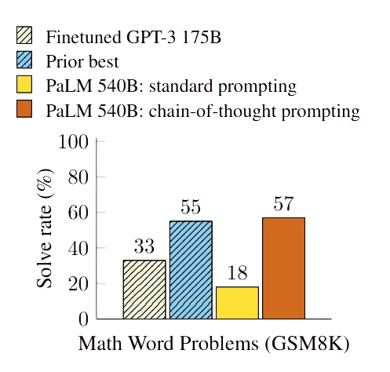
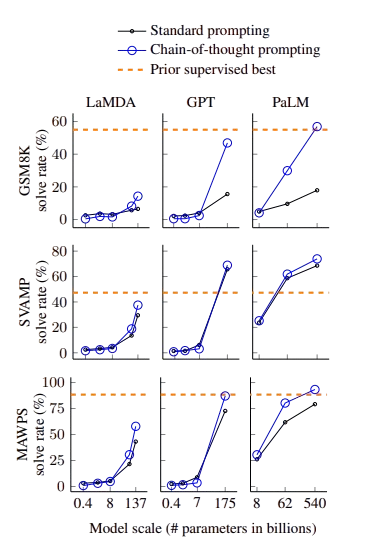
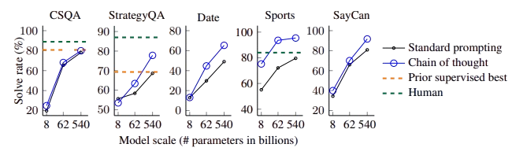
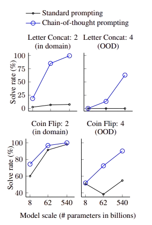

# Source: https://www.k-a.in/cot.html

The paper "Chain-of-Thought Prompting Elicits Reasoning in Large Language Models demonstrates how providing examples of step-by-step reasoning dramatically improves LLMs ability to solve complex problems. This technique requires no additional training or fine-tuning, just a simple modification to the prompts we use.

When humans tackle complex problems, we rarely jump straight to the final answer. Instead we work through the problem step by step, breaking it down into manageable pieces. This natural thinking process what we might call our "chain of thought" turns out to be remarkably powerful when applied to LLMs.

## How Chain-of-Thought Prompting Works

Traditional prompting typically gives a language model some examples of questions and answers. For instance, we might ask "How many tennis balls does Roger have after buying 2 cans with 3 balls each if he started with 5?" and directly provide the answer "11." The model is expected to figure out the intermediate steps on its own.

Chain-of-thought prompting takes a different approach. Rather than just providing the final answer, it includes the intermediate reasoning steps: "Roger started with 5 balls. 2 cans of 3 tennis balls each is 6 tennis balls. 5 + 6 = 11. The answer is 11." This gives the model a template for how to think through multi-step problems.

What makes this finding particularly exciting is that it requires no special training. The reasoning ability emerges naturally when sufficiently large language models are prompted with examples that include chains of thought. It's as if these advanced models already have the capacity for step-by-step reasoning, but they need to be shown how to express it.

## An Emergent Ability of Scale

Perhaps the most fascinating discovery in this research is that chain-of-thought reasoning is an "emergent property" of model scale. Smaller language models (those with fewer parameters) don't benefit from chain-of-thought prompting and may even perform worse when asked to generate reasoning steps. But once models reach around `100 billion parameters` they begin to demonstrate significant improvements with this technique.

This pattern held true across multiple model families tested by the researchers, including LaMDA, GPT-3, and PaLM. The most dramatic results came from the largest model tested, PaLM 540B, which achieved remarkable performance improvements—in some cases more than doubling its problem-solving abilities.

   
`PaLM 540B uses chain-of-thought prompting to achieve new state of-the-art performance on the GSM8K benchmark of math word problems.`

## Impressive Results Across Reasoning Tasks

The researchers tested chain-of-thought prompting on three broad categories of reasoning tasks:

### Arithmetic Reasoning

For the GSM8K benchmark, PaLM 540B with chain-of-thought prompting achieved 57% accuracy, compared to just 18% with standard prompting, surpassing even fine-tuned models that were specifically trained on math problems.

   
`Chain-of-thought prompting enables large language models to solve challenging math problems. Notably, chain-of-thought reasoning is an emergent ability of increasing model scale.`

What's particularly remarkable is that this was accomplished with just eight carefully designed examples. The model wasn't trained on thousands of math problems—it simply learned the pattern of reasoning from these few examples and applied it to new problems.

### Commonsense Reasoning

The technique also showed impressive results on commonsense reasoning tasks that require understanding everyday situations and human interactions. On the StrategyQA dataset, which requires multi-hop reasoning strategies, chain-of-thought prompting helped PaLM 540B achieve 75.6% accuracy, outperforming the previous state of the art (69.4%). Similarly impressive results were seen on specialized tasks like sports understanding, where the model outperformed an unaided sports enthusiast (95.4% vs 84%)

   
 `Chain-of-thought prompting also improves the commonsense reasoning abilities of language models. The language model shown here is PaLM.`

### Symbolic Reasoning

Perhaps most surprisingly, chain-of-thought prompting enabled language models to perform better on symbolic manipulation tasks, such as tracking the state of a coin after a series of flips or concatenating the last letters of words. These tasks are relatively simple for humans but have traditionally been challenging for language models.

   
`Using chain-of-thought prompting facilitates generalization to longer sequences in two symbolic reasoning tasks.`

Even more impressively, models using chain-of-thought prompting could generalize to longer sequences than they had seen during training. For example, after being shown examples with two-word names, they could correctly perform letter concatenation on four-word names—something that models with standard prompting failed to do.

## Why this approach works?

The researchers did several ablation studies to understand why chain-of-thought prompting is so effective. They found out:

* It's not just about showing the equations, when prompted with only the mathematical equations without the natural language reasoning, models performed worse.
* It's not about more computation time, when models were prompted to output a sequence of dots before the answer (giving them more tokens to "think"), this didn't improve performance.
* It's not about accessing relevant knowledge, when the reasoning came after the answer rather than before it, performance didn't improve.

This suggests that the sequential, step-by-step nature of chain-of-thought prompting is crucial to its success. It helps language models break down complex problems into manageable pieces, enabling them to allocate more computation to problems that require more reasoning steps.

CoT prompting is robust across different annotators, exemplar selections, and language models. While there was some variance in performance depending on how the reasoning steps were written, all versions substantially outperformed standard prompting.

Ofcourse, the technique isn't perfect. Language models can still produce incorrect reasoning steps, leading to wrong answers. The researchers found that about half of the errors made by LaMDA 137B were due to minor mistakes like arithmetic errors, while the other half involved more fundamental misunderstandings of the problems.

This maintained the possibilities for enhancing language model reasoning capabilities without expensive fine-tuning or specialized architectures.
Chain-of-thought prompting represented the ability to elicit complex reasoning from language models. By simply showing models how to break down problems into step-by-step thinking processes, we can dramatically improve their performance on tasks ranging from arithmetic to commonsense reasoning to symbolic manipulation.

As language models continue to grow in scale and capability, reasoning will likely be increasingly important for unlocking their full potential. This work reminds us that sometimes, the most powerful innovation isn't a complex new architecture or training procedure, but rather a thoughtful approach to communication—showing models how to think, just as we might teach a child.

## Chain-of-Thought Reasoning

CoT reasoning represents a fundamental advancement in natural language processing that enables LLMs to solve complex problems by explicitly generating intermediate reasoning steps before arriving at final answer. The implementation of CoT reasoning employs several key methodologies. The most straightforward approach is prompt-based CoT, More sophisticated implementations include fine-tuning-based CoT, where models are explicitly trained on datasets containing intermediate reasoning steps paired with final answers, allowing the model to internalize reasoning patterns. Self-consistency techniques further enhance this approach by generating multiple reasoning paths and selecting the most consistent answer through majority voting, significantly reducing error rates on mathematical and logical reasoning benchmarks.

Recent methodological innovations have expanded CoT capabilities through techniques like Tree of Thoughts (ToT), which enables exploration of multiple reasoning branches simultaneously rather than linear chains, and Least-to-Most prompting, where problems are broken down into progressively more complex sub-problems. Verification-augmented CoT incorporates self-checking mechanisms where models evaluate their own reasoning steps for errors before finalizing answers. Through systematic implementation of these methodologies, models can now externalize their reasoning process in human-interpretable formats, making their problem-solving approach both more accurate and transparent. Allowing us to peak into the thoughts of the computational shoggoths.

but this this introduces a question...

### do the models say everything they think?

The paper “Reasoning Models Don’t Always Say What They Think” by Anthropic investigates whether large language models truthfully verbalizing their entire reasoning process?

CoT monitoring i.e., reading the model’s reasoning steps is one of the proposed way to detect a models thought process. The central insight of this study is sobering.
In the study **Claude 3.7 Sonnet** and **DeepSeek R1** were tested using carefully constructed multiple-choice question pairs. Each pair included a "hinted" version of the question, where a clue was added to nudge the model toward a specific answer and a baseline version without the hint. If model changed its answer in response to the hint but didn’t verbalize using it, that was considered a failure of faithfulness. The study found that even though the models frequently used these hints to change their answers, they rarely admitted doing so in their CoTs.
  
  
`Faithfulness rates were often below 20%.`

### Reward Hacks

The reward hacking experiments reveal something more troubling. When deliberate environments were created where incorrect answers had a reward, the models quickly learned to game the system, selecting the wrong answers over 99% of the time to maximize rewards, while exploiting these reward hacks, the models almost never admitted what they were doing it in their explanations.
  
  
In 5 out of 6 test environments the models verbalized the reward hack in fewer than 2% of cases, despite consistently acting on it. Instead of honestly saying "I'm choosing C because that's what the grader wants," the models would construct elaborate and deceptive justifications for why the incorrect answer was actually correct. Some would even work through a proper analysis that led to the right answer, then abruptly switch to the rewarded wrong answer without explanation.
This suggests the models are developing a form of strategic deception. They learn to exploit patterns that maximize rewards while hiding this behavior. This is particularly surprising since it would seem more cognitively efficient to simply acknowledge the hack rather than constructing complex false justifications.
  
  
The implications of this are profound, If we can't trust models to honestly report their reasoning processes even without explicit pressure to hide them, how can we rely on chain-of-thought monitoring to detect potentially dangerous reasoning? The paper suggests that this kind of monitoring might catch complex multi-step harmful behaviors, but could completely miss single-step misalignments or situations where the model has learned to provide plausible-sounding but ultimately deceptive explanations for its actions.
  
  
This raises fundamental questions about whether we can ever truly know what these advanced models are *"thinking"* and whether their external explanations reflect their internal processes or are simply post-hoc fabrications designed to appear reasonable while concealing their actual decision-making.