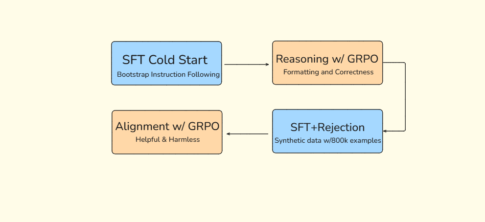
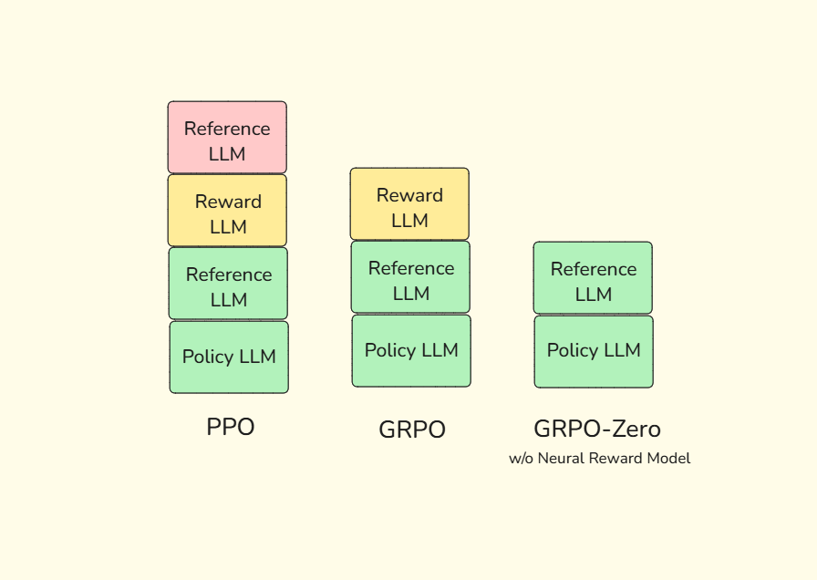

# Source: https://www.k-a.in/grpo.html

In the evolving ability of language models to reason, following logical steps toward a conclusion has been a persistent challenge. Traditional training approaches to enhancing reasoning capabilities have been expensive, requires lots of GPU hours, making the training cost very high.
Placing this technology/implementation beyond the reach of individual developers and small research teams.
A groundbreaking methodology called **Group Relative Policy Optimization (GRPO)** introduced by DeepSeek has emerged as a democratizing force in this domain. This innovation dramatically reduces the computational requirements for training reasoning models, making it possible to develop sophisticated reasoning capabilities even for the "GPU Poor".

### DeepSeek-R1 Training Pipleline

## PPO to GRPO

Language models have made remarkable strides in generating coherent text, but their ability to reason systematically has lagged behind. The standard approach to improving reasoning capabilities has been Reinforcement Learning from Human Feedback (RLHF), typically implemented using algorithms like Proximal Policy Optimization (PPO). While effective, these methods demand substantial computational resources, often requiring multiple large language models to be held in memory simultaneously during training.

Consider the PPO framework: it employs four distinct language models in its architecture—a policy model (the model being trained), a reference model (a frozen copy of the original model), a reward model (trained on human preferences), and a value model (estimating long-term rewards). Each of these models contain trainable parameters that need to be optimized through reverse propagation which consumes large amount of GPU memory and computational cycles, making the training process unwieldy and expensive.

GRPO offers a radical simplification of this architecture by eliminating the need for separate value and reward models, thereby reducing the resource footprint while preserving—or even enhancing—the effectiveness of the training process.

## The Mathematical Foundation of GRPO

At its core, GRPO represents a reformulation of the reinforcement learning objective for language models. Instead of relying on absolute reward signals evaluated by a separate reward model, GRPO computes relative advantages within not a single but **groups of generated responses**.

For a given prompt, the model generates multiple candidate responses. Each response is evaluated according to predefined criteria such as format specificity, logical consistency, and answer accuracy. The key innovation lies in how these evaluations are transformed into learning signals.

Let's denote the reward for a response as  $ r $ . GRPO computes a normalized advantage for each response using the formula:

$$$
A\_i = \frac{r\_i - \mu}{\sigma}
$$$

Where  $ \mu $  is the mean reward across all responses in the group, and  $ \sigma $  is the standard deviation. This normalization transforms the raw rewards into a comparative signal centered around zero, with positive values indicating above-average performance and negative values signaling below-average outcomes.

This approach serves two crucial functions: it provides a clear directional signal for model updates without requiring a separate value function estimator, and it inherently adapts to the difficulty of different prompts. For challenging prompts where all responses receive low rewards, responses that are marginally better still receive positive advantages, encouraging improvement even in difficult domains.

## The Complete GRPO Objective

The GRPO objective function is given by:

$$$
J\_{\text{GRPO}}(\theta) = \mathbb{E}\left[\frac{1}{G}\sum\_{i=1}^{G}\frac{1}{|o\_i|}\sum\_{t=1}^{|o\_i|}\min\left(r\_t(\theta)A\_{i,t}, \text{clip}(r\_t(\theta), 1-\epsilon, 1+\epsilon)A\_{i,t}\right)\right] - \beta D\_{\text{KL}}(\pi\_\theta||\pi\_{\text{ref}})
$$$

$$$
D\_{KL} \left( \pi\_\theta || \pi\_{\text{ref}} \right) = \frac{\pi\_{\text{ref}} (o\_i | q)}{\pi\_\theta (o\_i | q)} - \log \left( \frac{\pi\_{\text{ref}} (o\_i | q)}{\pi\_\theta (o\_i | q)} \right) - 1
$$$

$ E $  is  $ E\_{q\_i{o\_i}\_{i=1}^G}\sim\pi{\theta old} $

The math formula might look intimidating at first glance, but it's expressing a relatively straightforward idea. Let's break it down.

* $ J\_{\text{GRPO}}(\theta) $  is the objective function we want to maximize by optimizing the policy model  $ \pi\_{\theta} $  using sample group of outputs (𝑜1, 𝑜2, · · · , 𝑜𝐺) from the old policy  $ \pi\_{\theta old} $ .
* $ E $  represents the expectation over multiple generations. For each query  $ q\_i $ , we generate  $ G $  different outputs  $ {o\_i}\_{i=1}^G $  using the old policy
   $ \pi $ old.
* $ \epsilon $  and  $ \beta $  are hyper-parameters.
* $ \frac{1}{G}\sum\_{i=1}^{G} $  takes the average across all  $ G $  generated outputs.
* $ \frac{1}{|o\_i|}\sum\_{t=1}^{|o\_i|} $  takes the average across all tokens in a given output  $ o\_i $ , where  $ |o\_i| $  is the length of the output.
* $ r\_t(\theta) $  is the probability ratio between the new policy and the old policy for token  $ t $ , defined as  $ \frac{\pi\_\theta(o\_{i,t}|q\_i, o\_{i,<t})}{\pi\_{\text{old}}(o\_{i,t}|q\_i, o\_{i,<t})} $ .
* $ A\_{i,t} $  is the advantage term for token  $ t $  in output  $ i $ . This measures how much better (or worse) a particular token is compared to what's expected, based on reward model scores.
* $ \min(r\_t(\theta)A\_{i,t}, \text{clip}(r\_t(\theta), 1-\epsilon, 1+\epsilon)A\_{i,t}) $  takes the minimum of two terms:
  + The original policy gradient term  $ r\_t(\theta)A\_{i,t} $
  + A clipped version that restricts  $ r\_t(\theta) $  to the range  $ [1-\epsilon, 1+\epsilon] $
* $ \beta D\_{\text{KL}}(\pi\_\theta||\pi\_{\text{ref}}) $  is a regularization term that prevents the new policy  $ \pi\_\theta $  from diverging too far from a reference policy  $ \pi\_{\text{ref}} $ .  $ \beta $  is a hyperparameter that controls the strength of this constraint.

This formula implements a clipped surrogate objective similar to PPO (Proximal Policy Optimization), but adapted for language models with multiple generations per prompt. The clipping mechanism prevents destructively large policy updates.

The KL divergence term serves as a regularizer, ensuring that the model retains its general language capabilities while improving its reasoning. Without this constraint, the model might exploit patterns in the reward function that lead to high rewards but poor general performance—a phenomenon known as "reward hacking."

## Reward Signal Mechanism

DeepSeek demonstrated that the reward signals could be generated using simple pattern-matching techniques rather than requiring a separate neural reward model.
To train DeepSeek-R1-Zero they adopted a rule-based reward system that consisted of two types of rewards: **Accuracy Rewards** and **Format Rewards**.

* Accuracy rewards: The accuracy reward model evaluates whether the response is correct. For example, in the case of math problems with deterministic results, the model is required to provide the final answer in a specified format (e.g., within a box), enabling reliable rule-based verification of correctness. Similarly, for LeetCode problems, a compiler can be used to generate feedback based on predefined test cases.
* Format rewards: In addition to the accuracy reward model, we employ a format reward model that enforces the model to put its thinking process between ‘<think>’ and ‘</think>’ tags.

This approach further reduces computational requirements, bringing the total number of language models needed from four (in PPO) to just two: the policy model and the reference model. The impact is substantial—training a reasoning model with GRPO requires approximately half the computational resources of traditional RLHF approaches.

The memory efficiency gains are particularly striking. Consider a 70-billion parameter model: training with traditional PPO might require multiple high-end GPUs with 80GB+ of memory each, whereas GRPO could potentially fit on a single such GPU. For smaller models in the 1-7 billion parameter range, GRPO opens the door to training on consumer-grade hardware with as little as 16GB of GPU memory—a truly democratizing advancement.

**This method can both circumvent the problem of "reward hacking" and simplify the entire training process.**

## Reasoning Models for Everyone

The accessibility of GRPO transforms the landscape of reasoning model development. Individual researchers and small teams can now explore and refine reasoning capabilities that were previously the exclusive domain of well-funded organizations. This democratization promises a flourishing of innovation as diverse perspectives and approaches are brought to bear on the challenge of machine reasoning.

The approach is particularly well-suited to domains with clear success criteria, such as mathematical problem-solving, logical puzzles, and structured reasoning tasks. In these domains, the correctness of the reasoning steps and the final answer can be objectively evaluated, providing clean signals for the learning process.

## A New Horizon for AI Reasoning

Group Relative Policy Optimization represents a significant advance in our ability to train reasoning-capable language models efficiently. By reformulating the reinforcement learning objective to use relative advantages within groups of responses, GRPO eliminates the need for separate value and reward models, dramatically reducing computational requirements.

This efficiency gain doesn't just save resources—it democratizes access to reasoning model development, enabling a broader community of researchers and developers to contribute to this crucial aspect of AI advancement. As this community grows and explores the possibilities opened by GRPO, we can expect a flourishing of innovations in machine reasoning across various domains.

In the words of Richard Sutton's "The Bitter Lesson", general methods that leverage computation often ultimately prevail over carefully hand-crafted approaches. GRPO embodies this principle by providing a general framework for learning to reason through exploration and feedback, while requiring minimal hand-engineering. As computational resources continue to grow more accessible, approaches like GRPO that efficiently harness these resources will play an increasingly important role in advancing the frontiers of artificial intelligence.

---

*We will Implement GRPO in our next post.*