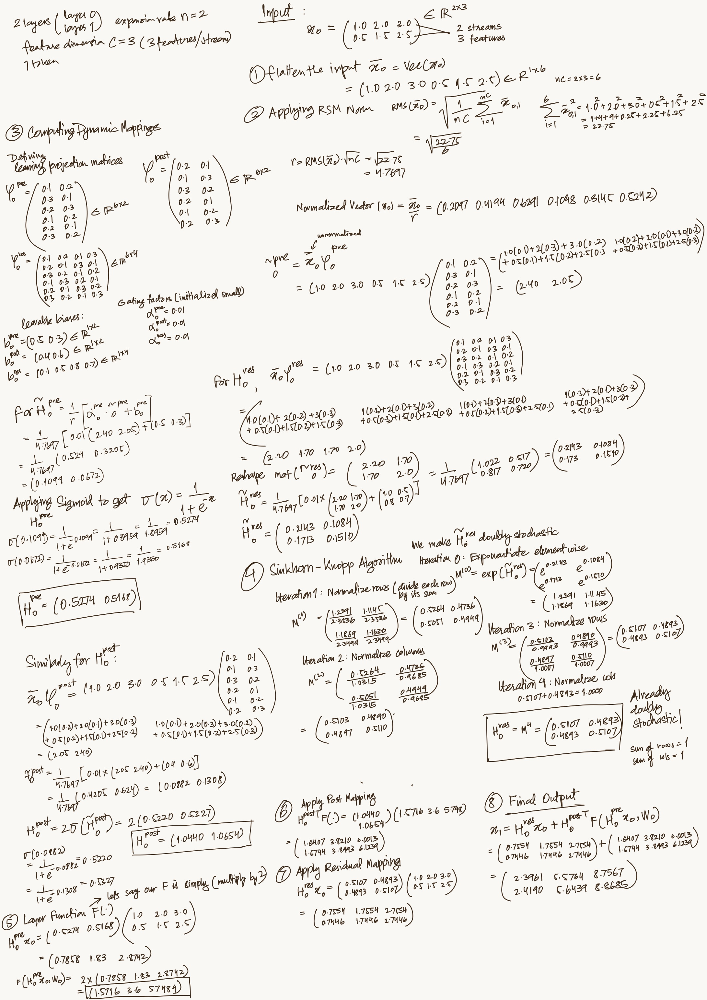

# Source: https://www.k-a.in/mHC-math.html

In this post we will derive "Manifold-Constrained Hyper-Connections" from scratch, building intuition for why each constraint solves a specific failure, and why this particular manifold turns out to be exactly the right place to constrain the system.

---

Imagine you're stacking blocks. Each block does something to your data, and you want to stack them really high (that's what "deep learning" means - lots of layers).

The simplest layer would just transform your input:

$$$
x\_{l+1} = F(x\_l, W\_l)
$$$

Here $ x\_l $ is your data at layer $ l $ , $ F $ is some function (could be anything - multiplication, attention, whatever), and $ W\_l $ are the parameters that function uses.

**But there's a problem.** When you stack 50 or 100 of these layers, information gets mangled. By layer 50, your network has completely forgotten what the input looked like. Gradients during training either explode to infinity or vanish to zero. Your network is basically broken.

### Residual Connection

In 2015 (Resnet paper), researchers discovered something brilliant. Instead of just transforming the input, what if we **add it back**?

$$$
x\_{l+1} = x\_l + F(x\_l, W\_l)
$$$

This is the famous "residual connection" that powers basically every modern neural network.

Why does this work? Let's see what happens when we stack multiple layers. If we go from layer $ l $ to layer $ L $ (some deeper layer):

$$$
x\_L = x\_l + \sum\_{i=l}^{L-1} F(x\_i, W\_i)
$$$

The key is the $ x\_l $ term - the **identity mapping**. No matter how deep we go, the original signal $ x\_l $ flows directly to $ x\_L $ without any modification. Even if all the $ F $ functions return garbage, the network can still pass information forward.

This is like having an emergency highway that bypasses all the city traffic. Information can always get through.

But here's the thing - we only have **one highway lane** (dimension $ C $ ). What if we could have multiple lanes? What if we could mix information between lanes?

### Hyper Connections

This is where Hyper-Connections comes in. Instead of dimension $ C $ , let's expand to $ n \times C $ (say, 4 lanes instead of 1).

Now our hidden state becomes a matrix:

$$$
x\_l = \begin{pmatrix} x\_{l,0} \\ x\_{l,1} \\ x\_{l,2} \\ x\_{l,3} \end{pmatrix} \in \mathbb{R}^{n \times C}
$$$

And we introduce three new operations:

* $ H^{\text{pre}}\_l $ : decides how to **read** from these lanes before processing
* $ H^{\text{post}}\_l $ : decides how to **write** back after processing
* $ H^{\text{res}}\_l $ : decides how to **mix** the lanes in the residual stream

The formula becomes:

$$$
x\_{l+1} = H^{\text{res}}\_l x\_l + H^{\text{post}\top}\_l F(H^{\text{pre}}\_l x\_l, W\_l)
$$$

Lets break it down step by step:

**Reading**: $ H^{\text{pre}}\_l x\_l $ squashes our $ n $ lanes down to 1 lane (from $ n \times C $ to $1 \times C$) so $ F $ can process it

**Processing**: $ F(\cdot, W\_l) $ does the actual work (attention, feedforward, whatever)

**Writing**: $ H^{\text{post}\top}\_l $ expands the output back to $ n $ lanes

**Mixing**: $ H^{\text{res}}\_l x\_l $ mixes information between lanes in the residual stream

Now we have a better information flow.

But wait. Let's see what happens when we stack multiple HC layers. Going from layer $ l $ to layer $ L $ :

$$$
x\_L = \prod\_{i=1}^{L-l} H^{\text{res}}\_{L-i} \cdot x\_l + \sum\_{i=l}^{L-1} \left(\prod\_{j=1}^{L-1-i} H^{\text{res}}\_{L-j}\right) H^{\text{post}\top}\_i F(H^{\text{pre}}\_i x\_i, W\_i)
$$$

See that product $ \prod\_{i=1}^{L-l} H^{\text{res}}\_{L-i} $ ? This is **multiplying many matrices together**.

In the original residual connection, this was just the identity: $ x\_l $ passed through unchanged. But now we're multiplying potentially 50 or 100 matrices together!

What happens when you multiply random matrices together? Let me show you with a concrete example.

Say $ H^{\text{res}}\_l $ is:

$$$
H^{\text{res}}\_l = \begin{pmatrix} 2 & -1 & 0.5 & 0.3 \\ -0.8 & 1.5 & 0.2 & -0.4 \\ 0.6 & -0.3 & 1.8 & 0.1 \\ -0.2 & 0.7 & -0.6 & 2.1 \end{pmatrix}
$$$

When you multiply 50 of these together, some entries can become **thousands** or even **millions**. The researchers found values reaching 3000! Other entries become microscopic.

This is signal explosion and vanishing happening simultaneously in different lanes. Your gradient norm spikes randomly during training. Your loss curve looks like a heart monitor during a panic attack. The whole thing becomes unstable.

The fundamental problem: **we lost the identity mapping property**.

## Constraining to a Manifold

We want our lanes to mix (so we get the expressiveness of HC), but we need to preserve stability (like the original residual connection).

What if we constrain $ H^{\text{res}}\_l $ so that it **doesn't amplify or shrink signals** overall, **still allows mixing** between lanes
and **stays stable** when multiplied many times.

The solution is to make $ H^{\text{res}}\_l $ a **doubly stochastic matrix**.

### What's a Doubly Stochastic Matrix?

It's a matrix where all entries are **non-negative** (≥ 0) and each **row** and each **column sums to 1.**

For example:

$$$
H^{\text{res}}\_l = \begin{pmatrix} 0.4 & 0.3 & 0.2 & 0.1 \\ 0.2 & 0.5 & 0.1 & 0.2 \\ 0.3 & 0.1 & 0.4 & 0.2 \\ 0.1 & 0.1 & 0.3 & 0.5 \end{pmatrix}
$$$

Check the first row: 0.4 + 0.3 + 0.2 + 0.1 = 1.0

Check the first column: 0.4 + 0.2 + 0.3 + 0.1 = 1.0

### Why This Fits

**Norm Preservation**

When you multiply a vector by a doubly stochastic matrix, you're taking a **weighted average** of its components. Weighted averages can't make things bigger! Formally, the spectral norm is bounded: $ \|H^{\text{res}}\_l\|\_2 \leq 1 $ .

This means no explosion.

**Compositional Closure**

Here's the beautiful part. When you multiply two doubly stochastic matrices together, you get another doubly stochastic matrix!

So $ \prod\_{i=1}^{50} H^{\text{res}}\_i $ is still doubly stochastic, even after 50 layers. The stability property is preserved throughout the entire network.

**Geometric Interpretation**

Doubly stochastic matrices form something called the "Birkhoff polytope" - this is the convex hull of all permutation matrices.

What does this mean intuitively? Every doubly stochastic matrix is a weighted mixture of permutations. Applying $ H^{\text{res}}\_l $ is like shuffling your lanes (permutation) but in a soft, weighted way (convex combination).

As you go deeper, information gets more and more mixed between lanes, but nothing explodes or vanishes.

Okay, but how do we make $ H^{\text{res}}\_l $ doubly stochastic? We can't just tell the neural network "hey, obey these constraints."

### The Sinkhorn-Knopp Algorithm

This is an incredibly elegant iterative algorithm. Start with any matrix (call it $ \tilde{H}^{\text{res}}\_l $ , which is what your neural network produces). We want to project it onto the space of doubly stochastic matrices.

**Step 0:** Make all entries positive by taking exponential:

$$$
M^{(0)} = \exp(\tilde{H}^{\text{res}}\_l)
$$$

(We apply $ \exp $ element-wise)

**Step 1:** Normalize each row to sum to 1:

$$$
M^{(1)} = \text{normalize}\_{\text{rows}}(M^{(0)})
$$$

**Step 2:** Normalize each column to sum to 1:

$$$
M^{(2)} = \text{normalize}\_{\text{cols}}(M^{(1)})
$$$

**Step 3:** Repeat!

$$$
M^{(t)} = \text{normalize}\_{\text{rows}}\left(\text{normalize}\_{\text{cols}}(M^{(t-1)})\right)
$$$

After about 20 iterations, you get a doubly stochastic matrix! It's proven to converge.

The full formula is:

$$$
M^{(t)} = T\_r(T\_c(M^{(t-1)}))
$$$

where $ T\_r $ normalizes rows and $ T\_c $ normalizes columns.

Let me show you a concrete example. Start with:

$$$
\tilde{H} = \begin{pmatrix} 2.1 & 0.3 \\ -0.5 & 1.2 \end{pmatrix}
$$$

**Iteration 0:** Exponentiate:

$$$
M^{(0)} = \begin{pmatrix} e^{2.1} & e^{0.3} \\ e^{-0.5} & e^{1.2} \end{pmatrix} = \begin{pmatrix} 8.17 & 1.35 \\ 0.61 & 3.32 \end{pmatrix}
$$$

**Iteration 1:** Normalize rows:

$$$
M^{(1)} = \begin{pmatrix} 0.858 & 0.142 \\ 0.155 & 0.845 \end{pmatrix}
$$$

**Iteration 2:** Normalize columns:

$$$
M^{(2)} = \begin{pmatrix} 0.847 & 0.153 \\ 0.144 & 0.856 \end{pmatrix}
$$$

Keep going and it converges to a doubly stochastic matrix where both rows and columns sum to 1.

## mHC

here's the full algorithm for mHC:

**Step 1:** Flatten your input (so we capture full context):

$$$
\bar{x}\_l = \text{vec}(x\_l) \in \mathbb{R}^{1 \times nC}
$$$

**Step 2:** Apply RMSNorm and compute dynamic mappings:

$$$
\bar{x}'\_l = \text{RMSNorm}(\bar{x}\_l)
$$$
$$$
\tilde{H}^{\text{pre}}\_l = \alpha^{\text{pre}}\_l \cdot (\bar{x}'\_l \varphi^{\text{pre}}\_l) + b^{\text{pre}}\_l
$$$
$$$
\tilde{H}^{\text{post}}\_l = \alpha^{\text{post}}\_l \cdot (\bar{x}'\_l \varphi^{\text{post}}\_l) + b^{\text{post}}\_l
$$$
$$$
\tilde{H}^{\text{res}}\_l = \alpha^{\text{res}}\_l \cdot \text{mat}(\bar{x}'\_l \varphi^{\text{res}}\_l) + b^{\text{res}}\_l
$$$

Here $ \varphi $ are learnable projection matrices and $ b $ are learnable biases. The $ \alpha $ are small gating factors (initialized to 0.01) that control how much the dynamic part matters.

**Step 3:** Apply manifold constraints:

$$$
H^{\text{pre}}\_l = \sigma(\tilde{H}^{\text{pre}}\_l)
$$$
$$$
H^{\text{post}}\_l = 2\sigma(\tilde{H}^{\text{post}}\_l)
$$$
$$$
H^{\text{res}}\_l = \text{Sinkhorn-Knopp}(\tilde{H}^{\text{res}}\_l)
$$$

The $ \sigma $ is the sigmoid function, which makes things positive. We multiply by 2 for $ H^{\text{post}} $ to allow outputs up to 2 instead of just 1.

**Step 4:** Use them:

$$$
x\_{l+1} = H^{\text{res}}\_l x\_l + H^{\text{post}\top}\_l F(H^{\text{pre}}\_l x\_l, W\_l)
$$$

### The Complete Forward Pass (With Actual Shapes)

Let me walk through a single mHC layer with $ n=4 $ streams and hidden dimension $ C=1024 $ :

**Input**: $ \mathbf{x}\_l \in \mathbb{R}^{4 \times 1024} $ (4 streams, each with 1024 features)

**Step 1: Compute the three mappings**

Following the recipe above:

* $ H^{\text{pre}}\_l \in \mathbb{R}^{1 \times 4} $ (e.g., $ [0.25, 0.25, 0.25, 0.25] $ initially)
* $ H^{\text{post}}\_l \in \mathbb{R}^{1 \times 4} $ (e.g., $ [1.0, 1.0, 1.0, 1.0] $ initially)
* $ H^{\text{res}}\_l \in \mathbb{R}^{4 \times 4} $ (e.g., identity matrix initially)

**Step 2: Read from streams**

$$$
\text{layer\\_input} = H^{\text{pre}}\_l \mathbf{x}\_l
$$$

Matrix multiplication: $ [1 \times 4] \times [4 \times 1024] = [1 \times 1024] $

This aggregates the 4 streams into a single input vector.

**Step 3: Apply layer function**

$$$
\text{layer\\_output} = F(\text{layer\\_input}, W\_l)
$$$

Where $ F $ could be attention, FFN, whatever. Input shape $ [1 \times 1024] $ , output shape $ [1 \times 1024] $ .

**Step 4: Write back to streams**

$$$
(H^{\text{post}}\_l)^\top \text{layer\\_output}
$$$

Matrix multiplication: $ [4 \times 1] \times [1 \times 1024] = [4 \times 1024] $

(Note: Transpose $ (H^{\text{post}}\_l)^\top $ converts the row vector to a column vector)

This distributes the layer output across all 4 streams.

**Step 5: Mix streams**

$$$
H^{\text{res}}\_l \mathbf{x}\_l
$$$

Matrix multiplication: $ [4 \times 4] \times [4 \times 1024] = [4 \times 1024] $

This is happening in parallel with steps 2-4, mixing the original streams.

**Step 6: Combine**

$$$
\mathbf{x}\_{l+1} = H^{\text{res}}\_l \mathbf{x}\_l + (H^{\text{post}}\_l)^\top \text{layer\\_output}
$$$

Both terms are $ [4 \times 1024] $ , so we just add them element-wise.

**Output**: $ \mathbf{x}\_{l+1} \in \mathbb{R}^{4 \times 1024} $ (4 streams, ready for the next layer)

### Visualization with Numbers

Suppose at some point during training, you've learned:

$$$
H^{\text{res}}\_l = \begin{bmatrix} 0.7 & 0.1 & 0.1 & 0.1 \\ 0.1 & 0.7 & 0.1 & 0.1 \\ 0.1 & 0.1 & 0.7 & 0.1 \\ 0.1 & 0.1 & 0.1 & 0.7 \end{bmatrix}
$$$

This is doubly stochastic (rows and columns sum to 1). What does it do?

Each stream becomes 70% itself + 10% from each of the other three streams. This is a gentle mixing, mostly preserving each stream's identity, but allowing some cross-talk.

If instead you had:

$$$
H^{\text{res}}\_l = \begin{bmatrix} 0.25 & 0.25 & 0.25 & 0.25 \\ 0.25 & 0.25 & 0.25 & 0.25 \\ 0.25 & 0.25 & 0.25 & 0.25 \\ 0.25 & 0.25 & 0.25 & 0.25 \end{bmatrix}
$$$

Every stream becomes an equal 25% mixture of all four streams. Maximum mixing.

Or:

$$$
H^{\text{res}}\_l = \begin{bmatrix} 0 & 1 & 0 & 0 \\ 0 & 0 & 1 & 0 \\ 0 & 0 & 0 & 1 \\ 1 & 0 & 0 & 0 \end{bmatrix}
$$$

This is a permutation matrix (all 1s and 0s). Stream 0 becomes old stream 1, stream 1 becomes old stream 2, stream 2 becomes old stream 3, stream 3 becomes old stream 0. A pure rotation.

**Any doubly stochastic matrix is a weighted average of these permutations**. So mHC can learn any mixing strategy from "do nothing" to "completely shuffle," but can never amplify.

## The Deep Lesson

Sometimes in machine learning, we discover something that improves performance (like expanding the residual stream width). But it breaks something fundamental (the identity mapping property).

The solution isn't to give up on the idea. It's to add the right constraints. By projecting onto the manifold of doubly stochastic matrices, we get the best of both worlds: rich multi-lane information flow AND stable training.

This is how science progresses. ResNets gave us skip connections. HC expanded them. mHC fixed what HC broke while keeping what it gained.

---

*This is a rudimentary derivation of mHC from my notes, for further exploration see the paper.*