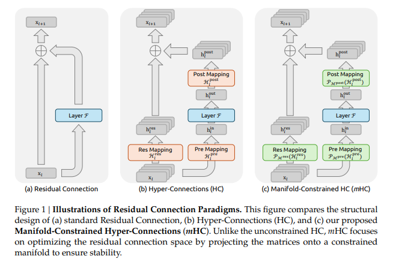
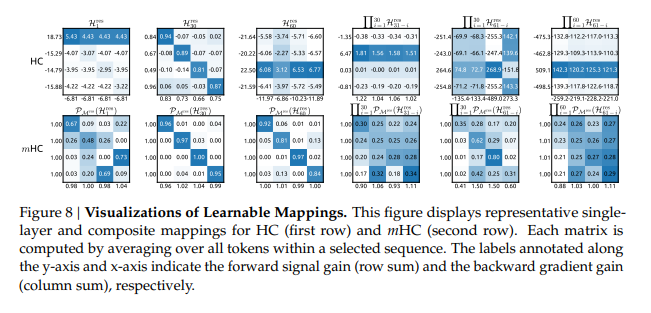

# Source: https://www.k-a.in/mHC.html

#### The next frontier of LLM training from Deepseek-AI.

---

For a decade, the residual connection has been the bedrock of deep learning. Every ResNet, every Transformer, every LLM relies on the same formula:

$$$
x\_{l+1} = x\_l + F(x\_l, W\_l)
$$$

This paradigm succeeded because of identity mapping the $ x\_l $ term passes unchanged through the network, stabilizing gradient flow. But this conservative design leaves performance on the table. The residual stream is narrow (C dimensions), and layers can only add to it, never reorganize it.

Recent work on Hyper-Connections(HC) tried to break this ceiling by expanding the residual stream width and diversifying connectivity patterns. It worked, models got measurably better. But as DeepSeek discovered when scaling to 27B parameters, this diversification fundamentally compromises the identity mapping property. The result: severe training instability and restricted scalability, compounded by substantial memory access overhead from the wider stream.
The paper proposes Manifold-Constrained Hyper-Connections (mHC) as a general framework that projects HC's unconstrained residual connection space onto a specific manifold. **The Birkhoff polytope of doubly stochastic matrices**. This projection restores the identity mapping property while preserving HC's expressivity gains, paired with infrastructure optimizations that keep the memory overhead manageable (just 6.7% slowdown at 27B scale).

The deeper contribution: demonstrating that constrained topological architecture design can outperform unconstrained approaches by guiding the optimization to explore useful regions of the search space.



The paper provides a visual comparison of three different architectural paradigms for residual connections in deep neural networks. It shows the evolution from standard residual connection to the unconstrained Hyper-Connections (HC) and finally to the proposed Manifold-Constrained Hyper-Connections (mHC).

#### Residual Connection

Depicts the classic residual mapping established by ResNet.

The input $ x $ passes through a layer $ \mathcal{F} $ (the residual function), and the output is the sum of the input and the transformation: $ x\_{l+1} = x\_l + \mathcal{F}(x\_l, W\_l) $ . As with the **Identity Mapping** the "shortcut" or identity connection (represented by the straight arrow) allows the signal to map directly from shallower to deeper layers without modification. Its crucial for training stability and gradient flow in very deep models.

#### Hyper-Connections (HC)

It is the architecture introduced in recent work from ByteDance to increase topological complexity.
The **Expanded Stream** unlike the standard version, HC expands the width of the residual stream by an expansion rate $ n $ . The feature dimension increases from $ C $ to $ n \times C $ . **Learnable Mappings** introduces three learnable linear mappings:

* **Res Mapping ( $ \mathcal{H}^{res} $ ):** A matrix in $ \mathbb{R}^{n \times n} $ that mixes features within the parallel residual streams.
* **Pre Mapping ( $ \mathcal{H}^{pre} $ ):** Aggregates the $ nC $ -dimensional stream into a $ C $ -dimensional input for the layer $ \mathcal{F} $ .
* **Post Mapping ( $ \mathcal{H}^{post} $ ):** Maps the $ C $ -dimensional output of the layer back into the $ nC $ -dimensional stream.

Because these matrices are unconstrained, they can cause signal amplification or attenuation, leading to instability during large-scale training.

#### Manifold-Constrained HC (mHC)

The paper proposes a solution to the stability issues of HC.
**Manifold Projection ( $ \mathcal{P}\_{\mathcal{M}} $ )**, the key difference is the application of a projection operator $ \mathcal{P}\_{\mathcal{M}} $ to the learnable mappings. The matrices ( $ \mathcal{H}^{res} $ , $ \mathcal{H}^{pre} $ , and $ \mathcal{H}^{post} $ ) are projected onto a specific manifold, specifically the **Birkhoff polytope of doubly stochastic matrices**.

By constraining the matrices such that their rows and columns sum to 1, mHC ensures that the "Res Mapping" functions as a convex combination of features. This restores the identity mapping property across multiple layers, preventing vanishing or exploding signals while maintaining the performance benefits of the widened residual stream.

## What Hyper-Connections Actually Do

Let's start with what HC changes. Instead of a single $ C $ -dimensional residual stream, HC expands it to $ n $ parallel streams of dimension $ C $ each, creating a hidden matrix $ \mathbf{x}\_l \in \mathbb{R}^{n \times C} $ . Think of it as $ n=4 $ parallel universes where your features evolve simultaneously.

To manage this expanded stream, HC introduces three learnable mappings,  **$ H^{\text{pre}}\_l \in \mathbb{R}^{1 \times n} $**  reads from the $ n $ streams and aggregates them into a single input for the layer.  **$ H^{\text{post}}\_l \in \mathbb{R}^{1 \times n} $**  takes the layer output and writes it back across the $ n $ streams.  **$ H^{\text{res}}\_l \in \mathbb{R}^{n \times n} $**  mixes information *between* the streams in the residual connection itself

The forward pass becomes:

$$$
x\_{l+1} = H^{\text{res}}\_l x\_l + H^{\text{post}\top}\_l F(H^{\text{pre}}\_l x\_l, W\_l)
$$$

$ H^{\text{res}}\_l $ provides most of the performance gain, it's the key innovation. But when you stack many layers, you get:

$$$
x\_L = \left(\prod\_{i=1}^{L-l} H^{\text{res}}\_{L-i}\right) x\_l + \sum\_{i=l}^{L-1} \left(\prod\_{j=1}^{L-1-i} H^{\text{res}}\_{L-j}\right) H^{\text{post}\top}\_i F(H^{\text{pre}}\_i x\_i, W\_i)
$$$

The problem is the product $ \prod\_{i=1}^{L-l} H^{\text{res}}\_{L-i} $ . In vanilla residual connections, this would just be the identity matrix $ I $ , preserving signal magnitude. But HC's unconstrained matrices amplify or attenuate signals unpredictably. Forward signal gain reaching peaks of 3000, a three-orders-of-magnitude deviation from the ideal value of 1.

## The Manifold Constraint: Doubly Stochastic Matrices

mHC's solution is to constrain $ H^{\text{res}}\_l $ to be a **doubly stochastic matrix**.

$$$
H^{\text{res}}\_l \mathbf{1}\_n = \mathbf{1}\_n \quad \text{and} \quad \mathbf{1}\_n^\top H^{\text{res}}\_l = \mathbf{1}\_n^\top
$$$

where $ \mathbf{1}\_n $ is a vector of all ones. Every row sums to 1, and every column sums to 1. The entries are also non-negative. This places $ H^{\text{res}}\_l $ on the **Birkhoff polytope**, the convex hull of all permutation matrices.

Why does this help?

* **Norm preservation**: The spectral norm $ \|H^{\text{res}}\_l\|\_2 \leq 1 $ , preventing gradient explosion
* **Compositional closure**: The product of doubly stochastic matrices is still doubly stochastic, so $ \prod\_{i=1}^{L-l} H^{\text{res}}\_{L-i} $ stays well-behaved
* **Geometric interpretation**: The operation $ H^{\text{res}}\_l x\_l $ is a convex combination of permuted features, pure feature mixing with no amplification

mHC's composite mapping stays bounded near 1.6, compared to HC's 3000.

For $ H^{\text{pre}}\_l $ and $ H^{\text{post}}\_l $ , mHC simply enforces non-negativity via a Sigmoid function. This prevents destructive interference from positive/negative coefficient combinations.

## Computing the Constrained Mappings

from the equation 7-8 in the paper (which proceeds in stages).

**Step 1: Flatten and normalize the input**

```
# x_l has shape [n, C], flatten it
x_vec = x_l.flatten()  # shape [n*C]
x_normalized = RMSNorm(x_vec)
```

**Step 2: Compute dynamic and static components**

Each mapping has two parts:

* **Dynamic**: Depends on the current input via learned projections $ \varphi^{\text{pre}}\_l, \varphi^{\text{post}}\_l, \varphi^{\text{res}}\_l $
* **Static**: Learnable biases $ b^{\text{pre}}\_l, b^{\text{post}}\_l, b^{\text{res}}\_l $

```
# Dynamic mappings (input-dependent)
H_pre_tilde = alpha_pre * (x_normalized @ phi_pre) + b_pre
H_post_tilde = alpha_post * (x_normalized @ phi_post) + b_post
H_res_tilde = alpha_res * (x_normalized @ phi_res).reshape(n, n) + b_res
```

The $ \alpha $ scalars are initialized to small values (0.01) to make the network start close to a standard residual connection.

**Step 3: Apply manifold constraints**

```
# Non-negativity via Sigmoid
H_pre = sigmoid(H_pre_tilde)
H_post = 2 * sigmoid(H_post_tilde)  # scaled to [0, 2]

# Doubly stochastic via Sinkhorn-Knopp
H_res = sinkhorn_knopp(H_res_tilde, iterations=20)
```

The Sinkhorn-Knopp algorithm is the workhorse here. It iteratively normalizes rows and columns:

$$$
M^{(t)} = T\_r(T\_c(M^{(t-1)}))
$$$

where $ T\_r $ and $ T\_c $ are row and column normalization. Starting from

$ M^{(0)} = \exp(\tilde{H}^{\text{res}}\_l) $ (to ensure positivity)

this converges to a doubly stochastic matrix. The paper uses 20 iterations as a practical compromise between accuracy and speed.



In the learned mappings notice how HC's matrices have wildly varying row/column sums (labels on the axes), while mHC's stay close to 1.

## The Forward Pass with mHC

Once you have the constrained mappings, the forward pass is:

```
def mhc_layer(x_l, layer_func, W_l):
    # x_l has shape [n, C]
    
    # Compute mappings (as above)
    H_pre, H_post, H_res = compute_mappings(x_l)
    
    # Read from streams: aggregate n streams -> single input
    layer_input = H_pre @ x_l  # shape [1, C] after [1,n] @ [n,C]
    
    # Apply layer function
    layer_output = layer_func(layer_input, W_l)  # shape [1, C]
    
    # Write back and mix streams
    x_next = H_res @ x_l + H_post.T @ layer_output
    # [n,n]@[n,C] + [n,1]@[1,C] = [n,C]
    
    return x_next
```

$ H^{\text{res}}\_l $ acts as a feature router. It can permute, blend, or route information between streams, but it can never amplify the average signal. The doubly stochastic property ensures $ H^{\text{res}}\_l x\_l $ is always a convex combination of the input rows.

## Infrastructure Optimizations to make things Fast

The expanded residual stream has a cost. HC increases memory access from

2 $ C $ (read) + $ C $ (write) to $ (5n+1)C + n^2 + 2n $ (read) + $ (3n+1)C + n^2 + 2n $ (write).

With $ n=4 $ and typical $ C \sim 10^3 $ , this is substantial.

mHC addresses this through the following optimizations:

#### Kernel Fusion

The paper fuses operations that share data. For example, computing all three mappings requires scanning the same input $ \vec{x}\_l $ . The fused kernel (Equations 14-15) does:

```
# Single pass computes all three at once
[H_pre_tilde, H_post_tilde, H_res_tilde] = x_l @ phi_l  # [1,nC] @ [nC, n^2+2n]
r = ||x_l||^2 / sqrt(nC)  # normalization factor

# Second fused kernel applies gating and bias
[H_pre_tilde, H_post_tilde, H_res_tilde] = (1/r) * [alpha_pre * ..., alpha_post * ..., alpha_res * ...] + b_l
```

A separate kernel fuses the Sinkhorn-Knopp iteration, and another fuses $ H^{\text{res}}\_l x\_l + H^{\text{post}\top}\_l F(\cdot) $ . These kernels are implemented in TileLang with mixed precision (tfloat32 for accumulation, bfloat16 for storage).

#### Selective Recomputation

Instead of storing all intermediate activations, mHC only saves $ x\_{l\_0} $ at the start of each recomputation block of $ L\_r $ consecutive layers. During backpropagation, it recomputes the mHC kernels on-the-fly. The optimal block size minimizes total memory:

$$$
L\_r^\* = \arg\min\_{L\_r} \left[ nC \times \left\lceil \frac{L}{L\_r} \right\rceil + (n+2)C \times L\_r \right] \approx \sqrt{\frac{nL}{n+2}}
$$$

For a 60-layer model with $ n=4 $ , this gives $ L\_r^\* \approx 6 $ layers per block, aligning with typical pipeline stage sizes.

#### DualPipe Communication Overlap

Pipeline parallelism sends activations between stages. mHC's $ n $ -fold wider stream increases communication cost. Figure 4 shows the scheduling trick: execute the post-residual kernel ( $ F^{\text{post,res}}\_M $ ) on a high-priority compute stream while pipeline sends/receives happen on a separate stream. The recomputation (marked "Whole Stage Recompute") runs independently since it only needs the cached $ x\_{l\_0} $ .

The result: **6.7% training overhead** for $ n=4 $ at 27B scale.

## The Geometric Intuition

The doubly stochastic matrices work so well because of the way the Birkhoff polytope is structured. Its vertices are permutation matrices, and every doubly stochastic matrix is a convex combination of these vertices.

Think of $ H^{\text{res}}\_l $ as a soft permutation. It can say "stream 2 is 70% old stream 0 + 20% old stream 1 + 10% old stream 3," but the weights must sum to 1. Over many layers, the composite mapping $ \prod\_{i=1}^{L-l} H^{\text{res}}\_{L-i} $ increasingly mixes all streams, but the average signal intensity is conserved at every step.

This is fundamentally different from the identity mapping ( $ H^{\text{res}}\_l = I $ ), which preserves streams individually. mHC allows cross-stream communication while maintaining the stability guarantee. When $ n=1 $ , the doubly stochastic constraint degenerates to the scalar 1. Exactly recovering the original residual connection.

## What This Means for Architecture Design

mHC sits at the intersection of two trends in deep learning **Macro-architecture** of blocks connect (DenseNet, FractalNet, Deep Layer Aggregation) and **Efficient scaling** of getting more from fixed FLOPs by improving connectivity.

Previous work expanded the residual stream (RMT, MUDDFormer) but lacked stability mechanisms. mHC shows that **constraining the solution space can improve performance** the manifold projection is a step forward. By preventing pathological solutions (exploding gains), the model explores the useful part of the search space more effectively.

The general principle becomes when you give a model more flexibility (wider streams, learnable mixing), add geometric structure to guide it. The Birkhoff polytope is one choice; the paper suggests exploring other manifolds (e.g., orthogonal matrices, low-rank approximations) could yield different trade-offs.

The identity mapping was one of the key insights that made deep learning practical, ResNets trained 100+ layers without gradient issues. But it's also a conservative design because it prohibits layers from reorganizing the residual stream, forcing all information flow through additive updates.

mHC shows you can have both the stability of identity mappings *and* the expressivity of learnable routing, by constraining the routing to be doubly stochastic. The 5-7 point gains on downstream tasks and robust scaling behavior suggest this isn't just a marginal improvement its a different point in the design space that foundation models should explore.

The paper's outlook points to future work of exploring other manifolds (orthogonal constraints for rotation, low-rank for compression), combining mHC with sparse MoE routing, or using the framework for multi-modal fusion. The core insight is that topological structure + geometric constraints can unlock performance without instability feels like it has room to run.

---

*For the full mathematical details and ablation studies, see the paper. The implementation by tokenbender includes the fused kernels and recomputation logic. A deeper-dive will be presented in my next post.*