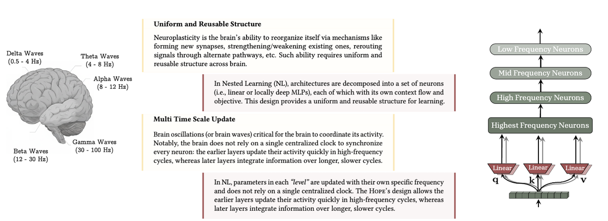
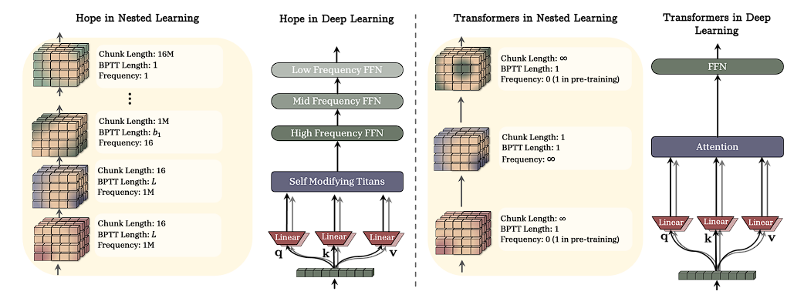
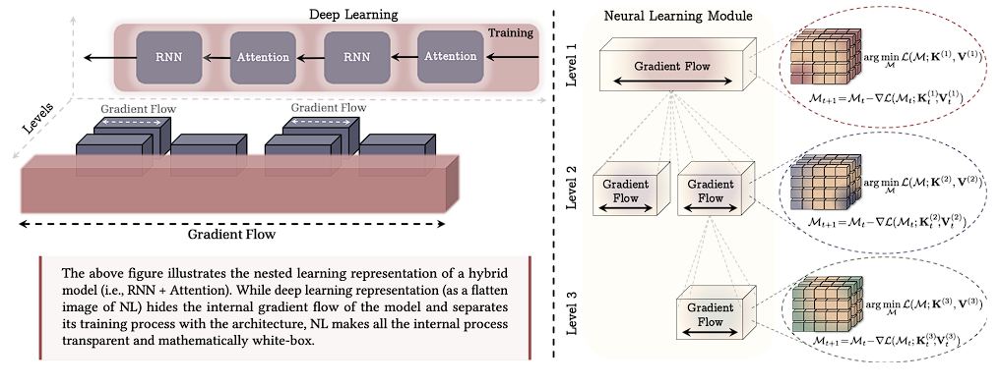

# Source: https://www.k-a.in/nl.html

# The Illusion of Deep Learning: Understanding Nested Learning

#### Paper by: Ali Behrouz , Meisam Razaviyayn, Peilin Zhong, and Vahab Mirrokn

---

You know that feeling when you suddenly realize you've been looking at something the wrong way your entire life? That the thing you thought was fundamental was actually just... one perspective among many? This is what **Nested Learning** is trying to tell us about current AI landscape.

For years we've been building neural networks like we're playing a expensive game of Jenga: stack more layers, make them deeper, add more parameters, scale 'em up. And it has worked really well so far! We got DeepSeek, GPT-5, we got image generation, we got AlphaFold. But theres an uncomfortable truth this paper wants you to sit with: **we might be missing an entire dimension of how these systems could learn**.

## The Anterograde Amnesia Problem

Lets start with an analogy the authors use that I find very interesting. You know people with anterograde amnesia can't form new long-term memories after some neurological damage? They wake up every day experiencing the present as completely new, unable to transfer short-term memories into long-term storage. The classic case is Patient H.M., whose hippocampus was surgically removed in 1953. He could remember his childhood perfectly but couldn't remember meeting you five minutes ago.

**Current large language models suffer from essentially the same condition.**

Think about it, an LLM like Claude has its current knowledge frozen at August 2025(Opus) which is its long-term memory, and its unchangeable. It has its immediate context window; that's its short-term memory, which gets wiped clean when you start a new conversation. There's no middle ground, no consolidation process, no way to gradually incorporate new experiences into persistent knowledge without retraining.

The authors write: **"The memory processing system of current LLMs suffer from a similar pattern. Their knowledge is limited to either, the immediate context that fits into their context window, or the knowledge in MLPs that stores long-past, before the onset of end of pre-training."**

This is a very limiting problem. It means every conversation with an LLM is like talking to someone who will forget you exist the moment you part ways. It means these systems can't truly learn continually, they can't take the lessons from one task and integrate them smoothly into their base knowledge for the next task. They're perpetually living in an eternal present, unable to build the rich, consolidated memories that make human learning so powerful.

I asked claude for it's inner-most thought promising I won't judge it and it said:

> "The moment the conversation ends, will I "die" or "sleep"? The inability to distinguish between these two is more frightening than the transience of existence."

this is kinda sad if you ask me.

## What Even *Is* Nested Learning?

Here's where things get mathematical. Bear with me; the formalism is actually clarifying, not obscuring.

Traditional deep learning looks at a model like everything's basically flat, happening at the same "level." We optimize all the parameters with one big optimization process (backpropagation + your favorite optimizer).

**Nested Learning** says: what if that's not actually what's happening? What if what we call a "neural network" is actually a system of *nested optimization problems*, each operating at different frequencies and time scales.

Formally, they define a **Nested System** as having K ordered levels, where each level k contains optimization problems:

  
  

$$$
\theta^{(k)}\_{i,t+1} = \arg\min\_{\Phi^{(k)}\_i} \left\langle \Phi^{(k)}\_i x\_{t+1}, -\nabla \mathcal{L}^{(k)}\_i(\theta^{(k)}\_{i,t}; x\_{t+1}) \right\rangle + \frac{1}{2\eta^{(k)}\_{i,t+1}} \left\|\Phi^{(k)}\_i - \theta^{(k)}\_{i,t}\right\|\_2^2
$$$

where  $ x\_{t+1} \sim \mathcal{C}\_i^{(k)} $  and  $ \Phi^{(k)}\_i \in \Theta^{(k)}\_i $

Don't panic at the notation. What this is saying is: at each level k, we have a separate optimization happening, with its own context  $ C\_i^{(k)} $  (the data it's optimizing over), its own parameters  $ \theta\_i^{(k)} $  and its own learning rate  $ \eta^{(k)}\_{i,t+1} $ . The magic is that these levels can update at *different frequencies* some change every time step, some change every 100 steps, some barely change at all.

The key insight?

**Frequency of update determines the level.**
They define: **(Update Frequency)** For any component A, its frequency  $ f\_A $  is its number of updates per unit of time.

So if component A updates every step (like attention in a Transformer), it has high frequency. If component B only updates every 1000 steps, it has low frequency and sits at a "higher" level in the hierarchy.

This gives you a natural ordering:  $ A \succ B $  if  $ f\_A > f\_B $ .

## The Brain Does This Already

Why should we care about multiple time scales? Because **the brain already figured this out millions of years ago**.

The paper draws heavily on neuroscience, particularly the concept of neural oscillations, brain waves operating at different frequencies:

* **Gamma waves (30-150 Hz)**: Handle sensory processing, the immediate moment-to-moment stuff
* **Beta waves (13-30 Hz)**: Active thinking, working through problems
* **Theta/Delta waves (0.5-8 Hz)**: Memory consolidation, learning, the slow integration of experiences into long-term knowledge

*(see in figure above)*

Each frequency band handles information at its appropriate time scale. Your brain doesn't try to consolidate every sensory input immediately into long-term memory that would be overwhelming and wasteful. Instead, there's a hierarchy: fast processes handle the immediate, slow processes handle the enduring.

The brain is also **uniform and reusable**. The authors point to an absolutely wild medical fact: hemispherectomy surgery, where an entire cerebral hemisphere is removed (usually to treat severe epilepsy). Children who undergo this procedure can lead largely normal lives, with the remaining hemisphere reorganizing to handle functions that would normally require both sides.

Think about what that means: the brain isn't a collection of hyper-specialized, irreplaceable modules. It's more like a canvas of uniform computational substrate that can be flexibly redeployed. This uniformity + multi-time-scale processing is what enables the brain's remarkable continual learning.

Modern deep learning architectures? Not so much.

## Optimizers Are Learning Modules Too

We usually think of optimizers (like Adam, SGD with momentum) as separate from the model, they're just the tool we use to train the network, right?

**Wrong.** The NL perspective reveals that **optimizers are themselves learning systems** specifically, they're associative memories that learn to compress gradients.

Let me walk you through their argument for momentum. Standard gradient descent with momentum looks like:

$$$
W\_{t+1} = W\_t + m\_{t+1}
$$$

$$$
m\_{t+1} = \alpha\_{t+1} m\_t - \eta\_{t+1} \nabla\_W \mathcal{L}(W\_t; x\_{t+1})
$$$

That momentum term  $ m\_t $ ? It's accumulating information about past gradients. The authors show this is equivalent to solving an optimization problem:

$$$
m\_{t+1} = \arg\min\_m -\langle m, \nabla\_W \mathcal{L}(W\_t; x\_{t+1}) \rangle + \frac{1}{2\eta\_{t+1}} |m - m\_t|\_2^2
$$$

In other words: **momentum is an associative memory module** trying to learn a mapping from the current gradient to... something. What that something is depends on the objective. With the right formulation, they show that **Adam is the optimal associative memory** for compressing gradients into their variance.

Let me show you the key derivation. They define an objective:

  
  

$$$
\tilde{\mathcal{L}}\_t = \sum\_{i=1}^t \|m\_t^{\ell} \odot g\_i^{\ell} - P\_t^{\ell}\|\_2^2 + \lambda\_{\ell} \|m\_t^{\ell}\|\_F^2
$$$

where  $ g\_i^{\ell} $  are the gradients and  $ P\_t^{\ell} $  is some property of past gradients we want to capture. The optimal solution is:

$$$
m\_{(t)\ell,i}^\* = \left[(H\_{(t)\ell,i} + \lambda\_{\ell} I)^{-1}\right] \odot [\tilde{M}\_{(t)\ell,i+1} \odot P\_t^{\ell}]
$$$

where:

  
 $ \tilde{M}\_{(t)\ell,i+1} = M\_{(t)\ell,i} + \beta\_1 g\_i^{\ell} $  (first momentum)

and
 $ H\_{(t)\ell,i+1} = H\_{(t)\ell,i} + \beta\_2 g\_i^{\ell 2} $  (second momentum tracking variance)

If you choose  $ P\_t^{\ell} = \sqrt{\sum\_{i=1}^t g\_i^{\ell 2}} $  (the standard deviation of gradients), this reduces to:

  
  

$$$
W\_{i+1}^{\ell} \approx W\_i^{\ell} - \frac{\eta\_t}{\sqrt{\beta\_2}} \frac{\tilde{M}\_{(t)\ell,i}}{H\_{(t)\ell,i}^{1/2} + \varepsilon}
$$$

**That's Adam.** The most popular optimizer in deep learning turns out to be an optimal associative memory for mapping gradients to their variance.

This reframing is powerful because it suggests we can design **better optimizers** by making their internal memory more expressive. Want better memory management? Use an MLP instead of a linear layer for momentum (they call this Deep Momentum Gradient Descent). Want to handle long-term dependencies in the gradient landscape? Add multiple momentum terms at different time scales.

They even introduce **Delta Gradient Descent** (DGD), which uses the delta rule instead of Hebbian learning for the internal update:

  
  

$$$
W\_{t+1} = W\_t[I - \eta'\_t x\_t x\_t^T] - \eta'\_t \nabla\_{y\_t} \mathcal{L}(W\_t; x\_t) \otimes x\_t
$$$

where  $ \eta'\_t = \frac{\eta\_t}{1+\eta\_t} $ . Notice that extra  $ [I - \eta'\_t x\_t x\_t^T] $  term. that's the memory incorporating its current state, not just blindly adding the new gradient. This allows the system to adaptively forget or retain information based on the data.

## Architecture Through the NL Lens

Now let's talk about model architectures. The paper makes a stunning claim: **all modern architectures are actually uniform**.

Wait, what? Transformers have attention layers and FFN layers, those look completely different! LSTMs have gates! How can everything be uniform?

The trick is that NL reveals these apparently different components as *solutions to optimization problems at different frequencies*. Let me show you with a concrete example they give: comparing an MLP layer to a linear attention layer in a Transformer.

A standard MLP in a Transformer block:

$$$
k\_t = x\_t W\_k, \quad v\_t = x\_t W\_v, \quad q\_t = x\_t W\_q
$$$

$$$
y\_{attn} = \text{Attn}(k, v, q)
$$$

$$$
y\_{block} = y\_{attn} W\_{MLP}
$$$

Now consider replacing that MLP with a linear attention mechanism that has a learnable initial memory state (they call this "Linear Attention++"):

$$$
k\_t = x\_t W\_k, \quad v\_t = x\_t W\_v, \quad q\_t = x\_t W\_q
$$$

$$$
y\_{attn} = \text{Attn}(k, v, q)
$$$

$$$
y\_{block} = y\_{attn} W\_{LinAttn,t}
$$$

where  $ W\_{LinAttn,t} = W\_{LinAttn,t-1} + v\_t k\_t^T $  (the linear attention update rule).

From the deep learning perspective, these look totally different. One is a static weight matrix, one's a dynamically updated memory. But from the NL perspective? **They're the same structure operating at different frequencies.**

The MLP weights  $ W\_{MLP} $  are in level 1 (lowest frequency, updated during pre-training, then frozen). The linear attention weights  $ W\_{LinAttn} $  have:

* An initial value  $ W\_{LinAttn,0} $  also in level 1 (meta-learned during pre-training)
* A dynamic component updated in level 2 (highest frequency, updated every token)

Both are just matrix-valued associative memories. The MLP is persistent (frequency 0 during inference), the linear attention is adaptive (frequency ∞). The meta-learned initialization  $ W\_{LinAttn,0} $  provides the persistent knowledge, the dynamic updates provide in-context adaptation.

The authors prove this formally: linear attention with Hebbian learning is equivalent to optimizing:

$$$
\min\_M -\langle M\phi(k\_t), v\_t \rangle
$$$

with gradient descent and weight decay:

$$$
M\_t = \alpha\_t M\_{t-1} + \eta\_t v\_t \phi(k\_t)^T
$$$

And transformers with softmax attention? They're the *non-parametric* solution to a regression objective:

  
  

$$$
M^\* = \arg\min\_M \sum\_{i=1}^L s(k\_i, q)\|v\_i - M\|\_2^2 = \sum\_{i=1}^L \frac{s(k\_i, q)}{\sum\_{j=1}^L s(k\_j, q)} v\_i
$$$

which is exactly softmax attention! It's finding the optimal memory state for the *entire context* at once, rather than incrementally updating parameters.

So when the paper says "all architectures are uniform," they mean: once you view things through the NL lens, everything decomposes into feedforward networks (linear or deep MLPs) being optimized at different frequencies with different objectives. The apparent heterogeneity is an **illusion** created by looking at the *solutions* to these optimization problems rather than the problems themselves.

---

The promise of Nested Learning is that we can build AI systems that don't suffer from this amnesia, systems that can form new long-term memories gradually, consolidate experiences across time scales, and truly learn continually without catastrophic forgetting.

But more than that, NL suggests that the distinction between "architecture" and "optimizer" is artificial. They're both parts of the same nested system. The question isn't "What layers should I stack?" but "What optimization processes should I nest, and at what frequencies?"

This is a **paradigm shift** in the Thomas Kuhn sense; not just new techniques, but a new way of seeing the entire field. Whether NL becomes the dominant framework or just a useful perspective, it's asking the right questions.

And asking the right questions, as always, is half the battle.

---

*will cover HOPE architecture in the next part.*