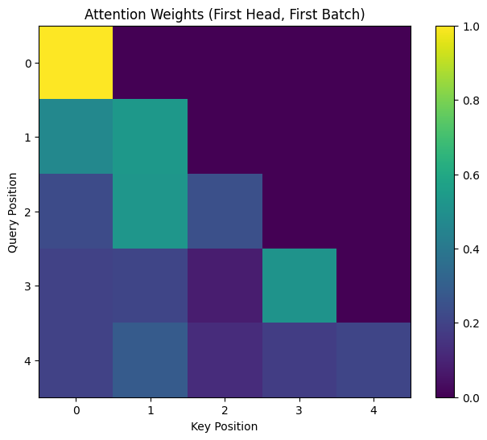

# Source: https://www.k-a.in/pyt-mha.html

Today, we're going to understand multi-headed attention (MHA) by implementing it in PyTorch.

Let's dive in.

## Attention

At its core, multi-headed attention allows a model to focus on different parts of an input sequence simultaneously. Think of it as having multiple perspectives on the same information. The mathematical formula that drives attention is:

$$$
\mathop{Attention}(Q, K, V) = \underset{seq}{\mathop{softmax}}\Bigg(\frac{Q K^\top}{\sqrt{d\_k}}\Bigg)V
$$$

Here, Q (query), K (key), and V (value) are different projections of the input data. The intuition is that we're trying to find which keys match our query, and then we retrieve the corresponding values.

## Code Structure

The implementation consists of two main classes:

* `PrepareForMultiHeadAttention`: Transforms input vectors into the right shape for multi-head processing
* `MultiHeadAttention`: The main class that performs the attention mechanism

Let's start by looking at the preparation class:

```
class PrepareForMultiHeadAttention(nn.Module):
    def __init__(self, d_model: int, heads: int, d_k: int, bias: bool):
        super().__init__()
        # Linear layer for transformation
        self.linear = nn.Linear(d_model, heads * d_k, bias=bias)
        # Number of attention heads
        self.heads = heads
        # Dimension of each head
        self.d_k = d_k

    def forward(self, x: torch.Tensor):
        # Save original shape (except last dimension)
        head_shape = x.shape[:-1]
        
        # Apply linear transformation
        x = self.linear(x)
        
        # Reshape to separate heads
        x = x.view(*head_shape, self.heads, self.d_k)
        
        return x
```

This class takes an input tensor and transforms it through a linear layer. Then it reshapes the output to separate the different attention heads. If our input has shape `[seq_len, batch_size, d_model]`, the output will have shape `[seq_len, batch_size, heads, d_k]`.

Now, let's look at the main attention class:

## Multi-Head Attention Implementation

```
class MultiHeadAttention(nn.Module):
    def __init__(self, heads: int, d_model: int, dropout_prob: float = 0.1, bias: bool = True):
        super().__init__()
        
        # Features per head
        self.d_k = d_model // heads
        self.heads = heads
        
        # Transform query, key, value
        self.query = PrepareForMultiHeadAttention(d_model, heads, self.d_k, bias=bias)
        self.key = PrepareForMultiHeadAttention(d_model, heads, self.d_k, bias=bias)
        self.value = PrepareForMultiHeadAttention(d_model, heads, self.d_k, bias=True)
        
        self.softmax = nn.Softmax(dim=1)
        self.output = nn.Linear(d_model, d_model)
        self.dropout = nn.Dropout(dropout_prob)
        self.scale = 1 / math.sqrt(self.d_k)
        
        self.attn = None
```

The initialization creates three projection layers for query, key, and value vectors. It also sets up the scaling factor of `1/sqrt(d_k)`, which prevents the dot products from growing too large when the dimension increases.

Now, let's see how the forward pass works:

```
def forward(self, *, query, key, value, mask=None):
    seq_len, batch_size, _ = query.shape
    
    if mask is not None:
        mask = self.prepare_mask(mask, query.shape, key.shape)
    
    # Transform inputs
    query = self.query(query)
    key = self.key(key)
    value = self.value(value)
    
    # Calculate attention scores
    scores = self.get_scores(query, key)
    
    # Scale scores
    scores *= self.scale
    
    # Apply mask if provided
    if mask is not None:
        scores = scores.masked_fill(mask == 0, float('-inf'))
    
    # Apply softmax
    attn = self.softmax(scores)
    
    # Apply dropout
    attn = self.dropout(attn)
    
    # Multiply by values
    x = torch.einsum("ijbh,jbhd->ibhd", attn, value)
    
    # Save attention weights
    self.attn = attn.detach()
    
    # Reshape and apply output layer
    x = x.reshape(seq_len, batch_size, -1)
    return self.output(x)
```

## Attention Mechanism Step-by-Step

Let's break down what's happening in the forward pass:

* First, we transform our query, key, and value vectors using the preparation class.
* Then, we calculate attention scores using the `get_scores` method:

```
def get_scores(self, query: torch.Tensor, key: torch.Tensor):
    # Calculate dot product between queries and keys
    return torch.einsum('ibhd,jbhd->ijbh', query, key)
```

This uses Einstein summation to compute the dot product between each query and key. The result has shape `[seq_len_q, seq_len_k, batch_size, heads]`.

* We scale the scores by `1/sqrt(d_k)` to prevent the softmax from having extremely small gradients.
* If we have a mask (useful for preventing attention to future tokens in autoregressive models), we apply it by setting masked positions to negative infinity.
* We apply softmax to get the attention weights, which tells us how much each position should "attend" to other positions.
* We apply dropout for regularization.
* Finally, we multiply the attention weights with the value vectors using another Einstein summation:

```
x = torch.einsum("ijbh,jbhd->ibhd", attn, value)
```

This gives us the weighted sum of the value vectors, where the weights are determined by the attention scores.

* We reshape the result to combine all heads and pass it through a final linear layer.

## Einstein Summation

The Einstein summation notation might look intimidating, but it's just a concise way to express tensor operations. In `'ibhd,jbhd->ijbh'`:

* `i` represents the query sequence dimension
* `j` represents the key sequence dimension
* `b` represents the batch dimension
* `h` represents the head dimension
* `d` represents the feature dimension

The operation computes the sum of products over the `d` dimension, resulting in a tensor with dimensions `i,j,b,h`.

## Masking Process

Masking is crucial in transformer models, especially for autoregressive tasks where we don't want to peek at future tokens:

```
def prepare_mask(self, mask: torch.Tensor, query_shape: List[int], key_shape: List[int]):
    # Ensure mask dimensions match
    assert mask.shape[0] == 1 or mask.shape[0] == query_shape[0]
    assert mask.shape[1] == key_shape[0]
    assert mask.shape[2] == 1 or mask.shape[2] == query_shape[1]
    
    # Add dimension for heads
    mask = mask.unsqueeze(-1)
    
    return mask
```

This function ensures the mask has the correct shape and adds an extra dimension for the attention heads.

## Putting It All Together

When we run this multi-headed attention module, each head can learn to focus on different aspects of the input sequence. Some heads might attend to local patterns, while others could capture long-range dependencies.

This allows transformers to process information in parallel and capture complex relationships in the data, which is why they've been so successful in natural language processing tasks.

The beauty of this implementation is that it's modular and can be used as a building block in various transformer architectures. By understanding how multi-headed attention works, you're one step closer to mastering one of the most influential innovations in modern deep learning.

```
Testing Multi-Head Attention...
Testing without mask...
Output shape: torch.Size([5, 2, 64])
Testing with causal mask...
Output shape: torch.Size([5, 2, 64])
Attention weights shape: torch.Size([5, 5, 2, 8])
All tests passed!
```




---

*full implementation > colab notebook*

*\* The following series of articles are a deeper walkthrough+implementation of Annotated Research Paper Implementations from labml.*