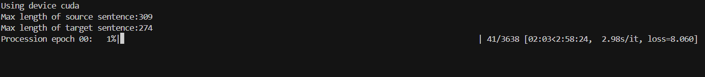

# Source: https://www.k-a.in/t1.html

I've been obsessed with language models lately, and tonight I'm implementing the Training module of the Transformer Architecture that we built last night > Transformer Code.

You know, the architecture that's eating the world right now. The goal? Build something that can translate between two languages using the attention mechanism that makes these models so powerful.

Let me walk you through the Training section in today's coding session.   


## Setting the Stage

```
import torch
import torch.nn as nn
from torch.utils.data import Dataset, DataLoader, random_split

from dataset import BilingualDataset, causal_mask
from model import build_transformer

from config import get_weights_file_path, get_config

from datasets import load_dataset
from tokenizers import Tokenizer
from tokenizers.models import WordLevel
from tokenizers.trainers import WordLevelTrainer
from tokenizers.pre_tokenizers import Whitespace

from torch.utils.tensorboard import SummaryWriter

import warnings

from tqdm import tqdm

from pathlib import Path
```

Man, that's a lot of imports. PyTorch is my go-to for deep learning (sorry TensorFlow fans), and I'm using HuggingFace's `datasets` and `tokenizers` libraries because why reinvent the wheel? Also, `tqdm` because watching progress bars is oddly satisfying.

I've split my code across multiple files for sanity - the dataset handling is in `dataset.py` and the actual transformer architecture is in `model.py`. Configuration stuff is in `config.py` because hardcoding values is a rookie mistake I've made too many times.

## Tokenization, because words are just spicy numbers

First, I need to build tokenizers for both source and target languages. A tokenizer converts text to numbers and vice versa - kind of like a secret code that the model can understand.

```
def get_all_sentences(ds, lang):
    for item in ds:
        yield item['translation'][lang]

def get_or_build_tokenizer(config, ds, lang):
    tokenizer_path = Path(config['tokenizer_file'].format(lang))
    if not Path.exists(tokenizer_path):
        tokenizer = Tokenizer(WordLevel(unk_token='[UNK]'))
        tokenizer.pre_tokenizer = Whitespace()
        trainer = WordLevelTrainer(special_tokens=["[UNK]","[PAD]","[SOS]","[EOS]"], min_frequency=2)
        tokenizer.train_from_iterator(get_all_sentences(ds, lang), trainer=trainer)
        tokenizer.save(str(tokenizer_path))
    else:
        tokenizer = Tokenizer.from_file(str(tokenizer_path))
    return tokenizer
```

I'm using a simple word-level tokenizer here. Not as fancy as BPE or WordPiece that the big boys use, but it'll do for my implementation. The `get_all_sentences` function is a generator that extracts sentences from the dataset for a specific language.

I've built in caching because training tokenizers repeatedly is like watching paint dry - once is enough. If the tokenizer file exists, we just load it; otherwise, we train a new one. I'm adding special tokens like `[UNK]` for unknown words, `[PAD]` for padding shorter sequences, and `[SOS]`/`[EOS]` to mark the start and end of sentences.

## Dataset preparation

```
def get_ds(config):
    ds_raw = load_dataset('opus_books', f'{config["lang_src"]}-{config["lang_tgt"]}', split='train')

    # Build tokenizers
    tokenizer_src = get_or_build_tokenizer(config, ds_raw, config['lang_src'])
    tokenizer_tgt = get_or_build_tokenizer(config, ds_raw, config['lang_tgt'])

    # Keep 90% for training and 10% for validation
    train_ds_size = int(0.9 * len(ds_raw))
    val_ds_size = len(ds_raw) - train_ds_size
    train_ds_raw, val_ds_raw = random_split(ds_raw, [train_ds_size, val_ds_size])

    train_ds = BilingualDataset(train_ds_raw, tokenizer_src, tokenizer_tgt, config['lang_src'], config['lang_tgt'], config['seq_len'])
    val_ds = BilingualDataset(val_ds_raw, tokenizer_src, tokenizer_tgt, config['lang_src'], config['lang_tgt'], config['seq_len'])
    
    max_len_src = 0
    max_len_tgt = 0

    for item in ds_raw:
        src_ids = tokenizer_src.encode(item['translation'][config['lang_src']]).ids
        tgt_ids = tokenizer_src.encode(item['translation'][config['lang_tgt']]).ids
        max_len_src = max(max_len_src, len(src_ids))
        max_len_tgt = max(max_len_tgt, len(tgt_ids))

    print(f'Max length of source sentence: {max_len_src}')
    print(f'Max length of target sentence: {max_len_tgt}')

    train_dataloader = DataLoader(train_ds, batch_size=config['batch_size'], shuffle=True)
    val_dataloader = DataLoader(val_ds, batch_size=1, shuffle=True)

    return train_dataloader, val_dataloader, tokenizer_src, tokenizer_tgt
```

I'm using HuggingFace's `opus_books` dataset which contains parallel texts in different languages. The cool thing about this function is that it handles everything from loading the data to creating DataLoaders.

The 90/10 split is pretty standard for train/validation. I'm wrapping the raw datasets in a custom `BilingualDataset` class (defined in `dataset.py`) that handles all the transformer-specific processing like adding start/end tokens and creating attention masks.

I also calculate the maximum sentence lengths just to sanity check our `seq_len` parameter. If our configured sequence length is too short, we'd truncate sentences and lose information.

## Building the Model

```
def get_model(config, vocab_src_len, vocab_tgt_len):
    model = build_transformer(vocab_src_len, vocab_tgt_len, config['seq_len'], config['seq_len'], config['d_model'])
    return model
```

This is just a thin wrapper around the `build_transformer` function from my `model.py` file. The actual transformer architecture is complex enough to deserve its own file (we did that last yesterday if you have read my previous post). It takes vocabulary sizes for both languages, maximum sequence lengths, and the model dimension as parameters.

## Training Loop, Viola!

```
def train_model(config):
    # Define the device
    device = torch.device('cuda' if torch.cuda.is_available() else 'cpu')
    print(f'Using device {device}')

    Path(config['model_folder']).mkdir(parents=True, exist_ok=True)

    train_dataloader, val_dataloader, tokenizer_src, tokenizer_tgt = get_ds(config)
    model = get_model(config, tokenizer_src.get_vocab_size(), tokenizer_tgt.get_vocab_size()).to(device)

    # Tensorboard
    writer = SummaryWriter(config['experiment_name'])

    optimizer = torch.optim.Adam(model.parameters(), lr=config['lr'], eps=1e-9)

    initial_epoch = 0
    global_step = 0
    if config['preload']:
        model_filename = get_weights_file_path(config, config['preload'])
        print(f'Preloading model {model_filename}')
        state = torch.load(model_filename)
        initial_epoch = state['epoch'] + 1
        optimizer.load_state_dict(state['optimizer_state_dict'])
        global_step = state['global_step']

    loss_fn = nn.CrossEntropyLoss(ignore_index=tokenizer_src.token_to_id('[PAD]'), label_smoothing=0.1).to(device)

    for epoch in range(initial_epoch, config['num_epochs']):
        model.train()
        batch_iterator = tqdm(train_dataloader, desc=f'Processing epoch {epoch:02d}')
        for batch in batch_iterator:

            encoder_input = batch['encoder_input'].to(device)
            decoder_input = batch['decoder_input'].to(device)
            encoder_mask = batch['encoder_mask'].to(device)  
            decoder_mask = batch['decoder_mask'].to(device)

            # Run the tensors through the transformer
            encoder_output = model.encode(encoder_input, encoder_mask)
            decoder_output = model.decode(encoder_output, encoder_mask, decoder_input, decoder_mask)
            proj_output = model.project(decoder_output)
            label = batch['label'].to(device)

            loss = loss_fn(proj_output.view(-1, tokenizer_tgt.get_vocab_size()), label.view(-1))
            batch_iterator.set_postfix({f"loss": f"{loss.item():6.3f}"})

            # Log the loss
            writer.add_scalar('train loss', loss.item(), global_step)
            writer.flush()

            # Backprop the loss
            loss.backward()

            # Update the weights
            optimizer.step()
            optimizer.zero_grad()

            global_step += 1

        # Save the model at the end of every epoch
        model_filename = get_weights_file_path(config, f'{epoch:02d}')
        torch.save({
            'epoch': epoch,
            'model_state_dict': model.state_dict(),
            'optimizer_state_dict': optimizer.state_dict(),
            'global_step': global_step
        }, model_filename)
```

This is where it all comes together. The training loop is pretty standard for PyTorch:

* move everything to the right device (GPU if available)
* set up the model, optimizer, and loss function
* support preloading a model for resuming training
* iterate through batches, compute loss, backpropagate, update weights
* save checkpoints

I'm using Adam optimizer with a very small epsilon (1e-9) because that's what the original Transformer paper used. The loss function is cross-entropy with label smoothing of 0.1, which helps prevent the model from being too confident and improves generalization.

The most interesting part is how we handle the masks. There are two types:

* `encoder_mask` prevents the model from attending to padding tokens in the source sequence
* `decoder_mask` combines padding masking with a causal mask that prevents the model from peeking at future tokens in the target sequence

Notice how we're saving checkpoints after each epoch. Training transformers is expensive, and I've been burned too many times by crashes or power outages to not save frequently.

I'm using TensorBoard to track the loss, which is super helpful for debugging. Nothing worse than training for hours only to find out your loss never decreased.

## Putting It All Together

```
if __name__ == '__main__':
    warnings.filterwarnings('ignore')
    config = get_config()
    train_model(config)
```

And finally, the entry point. I'm ignoring warnings because, let's be honest, who reads those at 3 AM? The `get_config` function loads our configuration (probably from a JSON or YAML file) with all the hyperparameters we need.

 ↵`Fn-F5`



Ok! It's going to take time, let me grab a coffee.