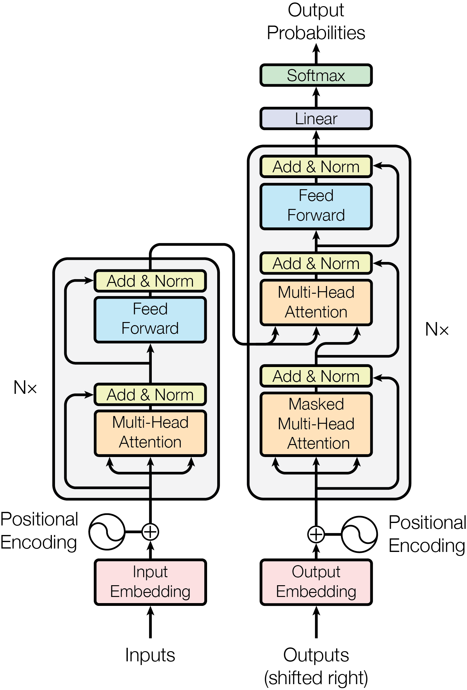
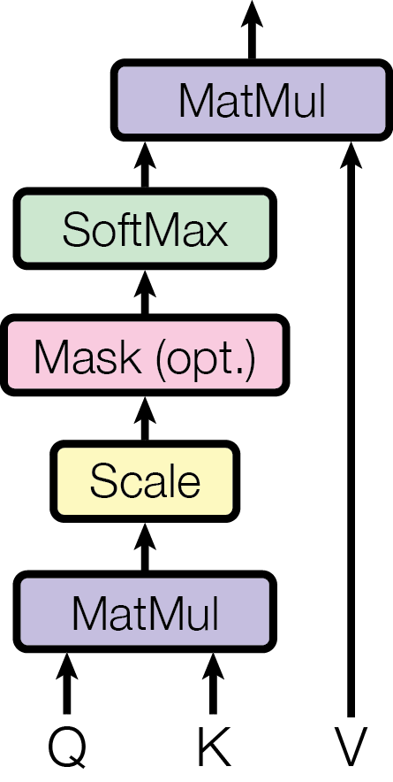
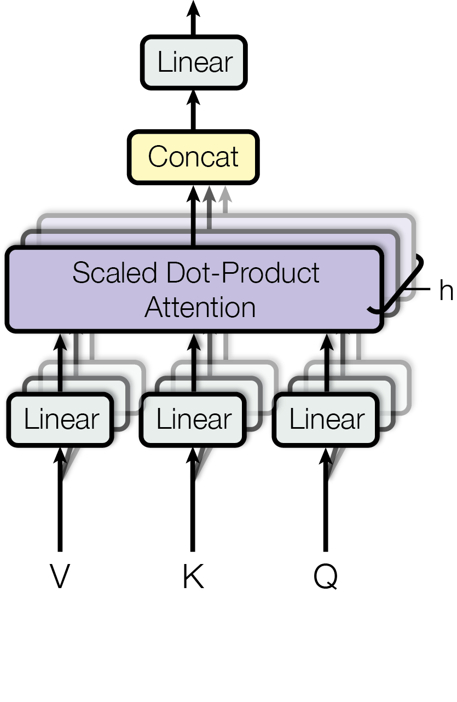

# Source: https://www.k-a.in/transformer.html

In 2017, researchers at google published "Attention is All You Need", the Holy Grail for Transformers, this article is a gentle introduction and preparation for you to read the paper.
The Transformer architecture introduced in this paper was a major breakthrough in sequence transduction methodologies, particularly within neural machine translation (NMT) and broader natural language processing (NLP). The seminal work by Vaswani et al. posited that recurrent neural networks (RNNs) and convolutional neural networks (CNNs) previously foundational for temporal or spatial dependencies could be supplanted by a novel **self-attention mechanism** operating over token embeddings. By eliminating recurrence, the Transformer architecture leveraged **scaled dot-product attention** and **multi-head attention layers** to model long-range dependencies with reduced inductive bias, enabling parallelizable computation across sequences via matrix operations.



### The Traditional Approach: Sequence-to-Sequence with RNNs

Before diving into Transformers, let's understand the problem they were designed to solve and the previous state-of-the-art approaches.

### The Sequence-to-Sequence Problem

In tasks like machine translation, we need to convert one sequence (e.g., "The cat eats the mouse" in English) to another sequence (e.g., its German translation). These are called sequence-to-sequence (seq2seq) tasks.

The traditional approach used an encoder-decoder architecture based on Recurrent Neural Networks (RNNs), typically Long Short-Term Memory networks (LSTMs) or Gated Recurrent Units (GRUs).

### How RNNs Process Sequences

Here's how a typical RNN-based seq2seq model would process our example:

### Encoding Phase

* Start with an initial hidden state (h₀), often initialized as zeros
* For the first word "The", convert it to a word vector (embedding) and feed it through the encoder function along with h₀ to produce h₁
* For the second word "cat", repeat the process using h₁ and the word vector for "cat" to produce h₂
* Continue until the entire input sentence is processed, resulting in a final hidden state (let's call it h₄ for our 5-word example)

### Decoding Phase:

* Start with the final encoder hidden state h₄
* Generate the first word of the translation by passing h₄ through the decoder
* The decoder outputs both a word and a new hidden state h₅
* For the next step, use h₅ and the previously generated word to predict the next word
* Continue until the complete translation is generated

This approach is illustrated in the diagram below:

```
Encoding:
The → Word Vector → Encoder(h₀, Word Vector) → h₁
cat → Word Vector → Encoder(h₁, Word Vector) → h₂
eats → Word Vector → Encoder(h₂, Word Vector) → h₃
...and so on

Decoding:
h₄ → Decoder → First translated word + h₅
h₅ + First word → Decoder → Second translated word + h₆
...and so on
```

### The Problem with RNNs: Long-Range Dependencies

This architecture has a fundamental limitation: information must flow through many transformations. Consider our example where we want to translate the word "eats". The information flow would be:

1. "eats" → word vector
2. Word vector → h₃ (through encoder)
3. h₃ → h₄ (as we process "the")
4. h₄ → h₅ (during first decoding step)
5. h₅ → h₆ (during second decoding step)
6. ...and possibly more steps before we generate the German equivalent of "eats"

This creates a **long path length** for information to travel. The longer this path, the more difficult it is for the model to maintain the relevant information. This is known as the **long-range dependency problem**.

## Attention: A Game-Changing Mechanism

Attention mechanisms were initially introduced as an enhancement to RNN-based models, not as a replacement. The core idea was simple but powerful: allow the decoder to "look back" at the original input sequence when generating each output word.

### How Basic Attention Works

In a model with attention:

* The encoder still processes the input sequence word by word, creating hidden states for each word (h₁, h₂, h₃, etc.)
* However, when the decoder generates a word, it doesn't rely solely on its current hidden state
* Instead, it computes "attention weights" that determine how much focus to put on each word in the original input
* The decoder then creates a weighted sum of all encoder hidden states based on these attention weights
* This weighted sum (context vector) is combined with the decoder's hidden state to generate the next word

This shortens the information path dramatically. Using our "eats" example again:

1. "eats" → word vector → h₃ (through encoder)
2. When generating the German equivalent, the decoder can directly attend to h₃, creating a much shorter path for the information to travel

This was a significant improvement, but the researchers behind "Attention is All You Need" asked a provocative question: do we need the recurrent structure at all, or can we build an architecture entirely on attention?

## The Transformer: Attention is All You Need!

The revolutionary claim of the paper was that we could discard the recurrent structure entirely and build a model based solely on attention mechanisms, leading to the Transformer architecture.

### Key Components of the Transformer

The Transformer consists of two main components:

* **Encoder**: Processes the input sequence
* **Decoder**: Generates the output sequence

Each of these components contains several key innovations:

### 1. Input and Positional Embeddings

In RNNs, word order is implicitly captured by the sequential processing. Since Transformers process all words simultaneously, they need a way to encode position information:

* **Word Embeddings**: Convert each token to a vector representation
* **Positional Encodings**: Add information about the position of each token in the sequence

The positional encodings use sine and cosine functions of different frequencies:

$$$
PE\_{(pos,2i)}=sin(pos/10000^{\frac{2i}{d\_{model}}})
$$$

$$$
PE\_{(pos,2i+1)}=cos(pos/10000^{\frac{2i}{d\_{model}}})
$$$

where  $ pos $ is the position and  $ i $ is the dimension. That is, each dimension of the position encoding corresponds to a sine wave. The wavelengths form a geometric progression from $2\pi$ from to $10000$ x $2\pi$. For any fixed offset  $ k,PE\_{pos+k} $  can be represented as a linear function of  $ PE\_{pos} $ .

This creates a unique pattern for each position, allowing the model to determine both absolute position and relative distances between words. You can visualize these as waves of different frequencies - longer waves encode coarse position information, while shorter waves encode fine-grained positions.

### 2. Multi-Head Attention

Read my intro on Multi-Head Attention

The heart of the Transformer is the attention mechanism, specifically "scaled dot-product attention." Let's break this down in detail:

### Understanding Attention as a Key-Value Lookup System

Attention can be understood as a content-addressable memory system with three components:

* **Keys (K)**: Index vectors that describe what information is available
* **Values (V)**: The actual information content
* **Queries (Q)**: Represent what information we're looking for

The process works as follows:

1. Compute the dot product between the query and all keys: QK^T
2. Scale the result by 1/√d\_k (where d\_k is the dimension of the keys)
3. Apply a softmax function to get probabilities
4. Use these probabilities to create a weighted sum of the values

### Scaled Dot-Product Attention



Mathematically: 
$$$
Attention(Q, K, V) = softmax(\frac{QK^T}{√d\_k})V
$$$

### Multi-Head Attention


  
Rather than performing a single attention function, the Transformer uses "multi-head attention," which:

1. Projects the queries, keys, and values into different subspaces (h different projections)
2. Performs attention on each of these projections in parallel
3. Concatenates the results and projects them back to the original dimension

This allows the model to attend to information from different representation subspaces at different positions simultaneously.

### 3. Three Types of Attention in the Transformer

The Transformer uses attention in three different ways:

1. **Self-Attention in the Encoder**: Each word in the input attends to all words in the input (including itself)
2. **Masked Self-Attention in the Decoder**: Each generated word attends to all previously generated words (not future words, hence "masked")
3. **Cross-Attention**: Each position in the decoder attends to all positions in the encoder

The third type is particularly important as it connects the encoder and decoder, allowing the decoder to focus on relevant parts of the input sequence when generating each word.

## The Transformer Architecture: Putting It All Together


Let's walk through the complete Transformer architecture -

### Encoder Stack

Each encoder layer contains:

1. **Multi-Head Self-Attention**: Allows each position to attend to all positions in the previous layer
2. **Position-wise Feed-Forward Network**: A simple fully connected network applied to each position independently
3. **Residual Connections and Layer Normalization**: Around each of the two sub-layers

The encoder processes the entire input sequence in parallel, creating representations that capture the contextual relationships between words.

### Decoder Stack

Each decoder layer contains:

1. **Masked Multi-Head Self-Attention**: Allows each position to attend to all previous positions
2. **Multi-Head Cross-Attention**: Allows the decoder to attend to the encoder's output
3. **Position-wise Feed-Forward Network**: Similar to the encoder
4. **Residual Connections and Layer Normalization**: Around each of the three sub-layers

The decoder generates the output sequence one token at a time, with each new token based on all previously generated tokens and the entire input sequence.

### Information Flow in the Transformer

The key advantage of the Transformer is the shortened path length for information flow:

* In RNNs, information from the first word must pass through every time step to reach the final representation
* In Transformers, every word can directly interact with every other word in a single attention layer

This direct connectivity means that the path length between any two positions is constant (O(1)) rather than growing with sequence length (O(n) in RNNs).

### The Key-Query-Value Mechanism:

Imagine the source sentence creates a set of key-value pairs. Each key is a "descriptor" of the information contained in the corresponding value. When the decoder needs information to generate the next word, it creates a query - essentially asking, "What information do I need right now?"

The attention mechanism then:

1. Checks how well each key matches the query (using dot product)
2. Focuses on the values corresponding to the best-matching keys

In vector space, this works because:

* If two vectors point in similar directions, their dot product will be large
* If they point in different directions, their dot product will be small

The softmax operation turns these dot products into a probability distribution, essentially selecting the most relevant keys while still allowing some attention to less relevant ones.

### Why Transformers Outperform RNNs

The Transformer architecture offers several advantages:

* **Shortened Path Length**: Information can flow directly between any positions, addressing the long-range dependency problem
* **Parallelization**: Unlike RNNs which must process sequences step-by-step, Transformers can process all tokens in parallel during training.
* **Multi-Head Attention**: Allows the model to jointly attend to information from different representation subspaces
* **Better Gradient Flow**: The direct connections and residual pathways allow for better gradient flow during training

### Training and Implementation

The paper describes several practical aspects of training Transformers:

* **Layer Normalization and Residual Connections**: These techniques help stabilize training
* **Regularization**: Dropout is applied to the attention weights and to the outputs of each sub-layer
* **Learning Rate Schedule**: A custom learning rate schedule with a warmup period

The model is trained using standard cross-entropy loss with label smoothing.

The original paper demonstrated that Transformers not only matched but exceeded the performance of previous state-of-the-art models on translation tasks, while requiring significantly less training time due to increased parallelization.

### One-Step Processing vs. Sequential Processing

Perhaps the most profound aspect of the Transformer is the paradigm shift it represents:

* **RNNs**: Process the entire sequence step by step, with each step dependent on the previous ones. The full sentence-to-sentence translation is treated as one training sample.
* **Transformers**: Process the entire source sequence and the target sequence generated so far in a single step. Each output token generation is treated as one training sample.

This shift from sequential processing to one-step processing with attention mechanisms has proven to be enormously effective, not just for translation but for virtually all sequence processing tasks.

Since its introduction, the Transformer architecture has been adapted in numerous ways:

* **BERT**: Uses only the encoder portion for bidirectional context understanding
* **GPT**: Uses only the decoder portion for unidirectional text generation
* **T5**: Uses the full encoder-decoder architecture for a wide range of NLP tasks
* **Vision Transformers**: Adapts the architecture for image processing
* **Speech Transformers**: Applies the approach to speech recognition and synthesis

This wide-ranging impact demonstrates the generality and power of the attention mechanism as a fundamental building block for neural networks.

# Why "Attention is All You Need" Was Revolutionary

The key insight of the paper was that direct connections through attention mechanisms could entirely replace recurrence. This seemingly simple architectural change:

* Addressed the long-range dependency problem of RNNs
* Enabled highly parallelized training
* Created a more flexible architecture that could model complex relationships between tokens

The Transformer architecture demonstrated that models don't need to process sequences sequentially to understand them effectively. Instead, by using attention to create direct pathways between all positions, models can capture dependencies regardless of distance, leading to the remarkable advances in AI we've seen in recent years.

This makes "Attention is All You Need" one of the most important papers in modern deep learning, setting the foundation for the language models that are transforming how we interact with technology today.

---

*Alright cool! You understand major parts of the transformer architecture, now is the best time for you to dive into the math involved in the paper, for building a better intuition in order to implement this paper, moving forward.*