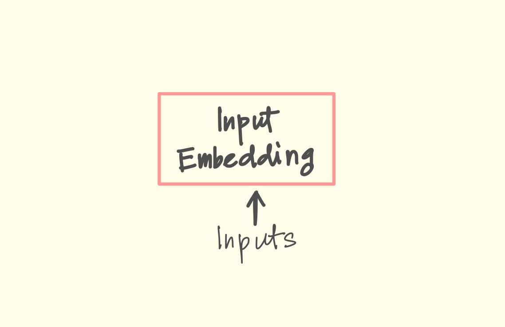
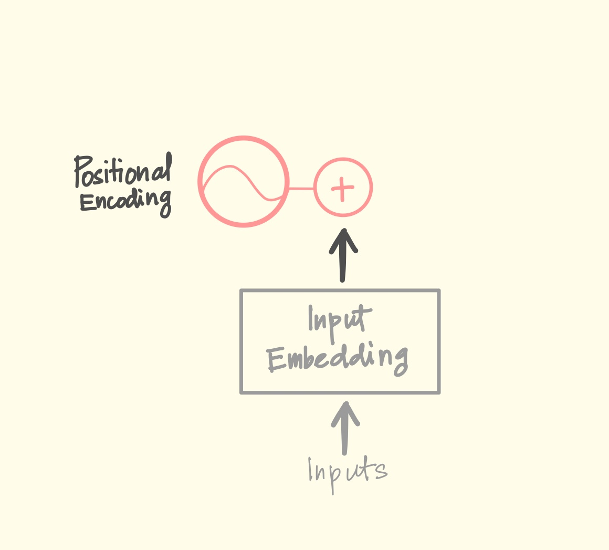
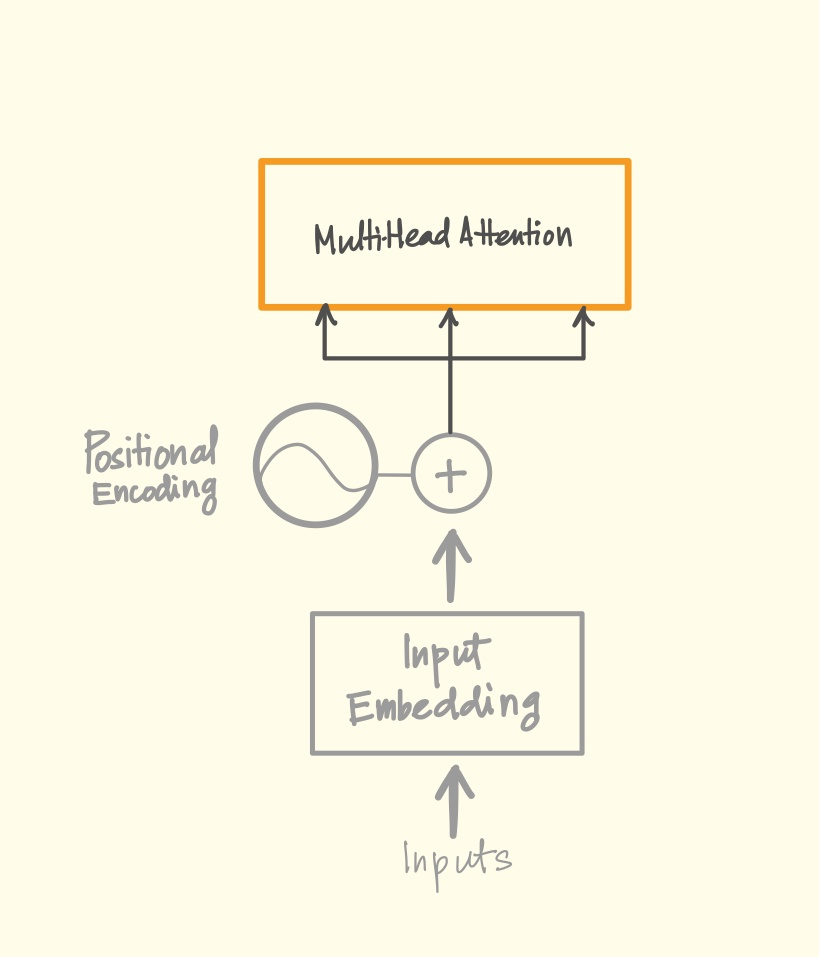
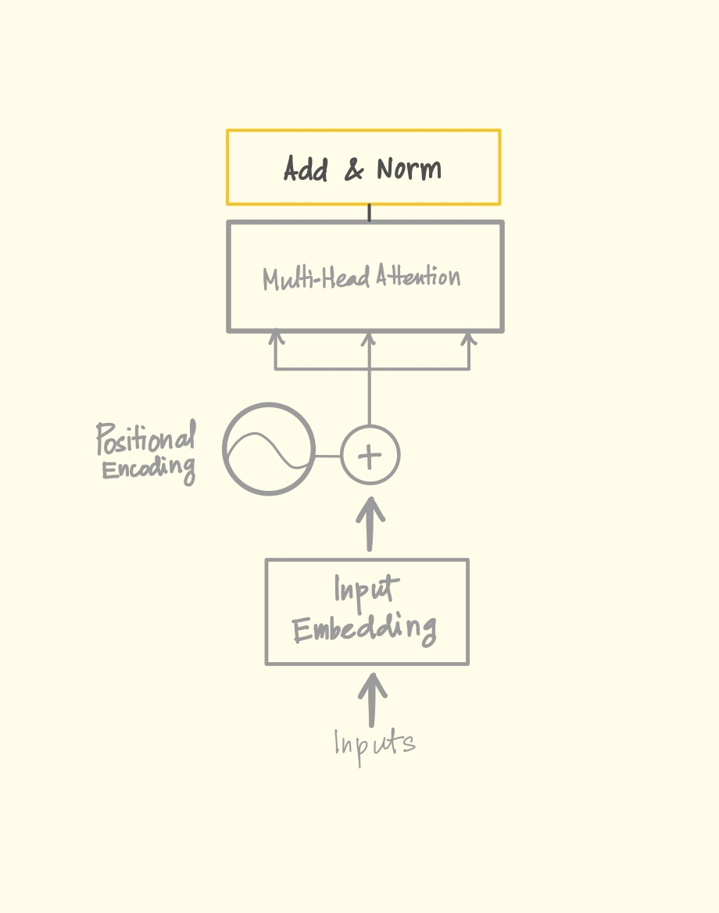
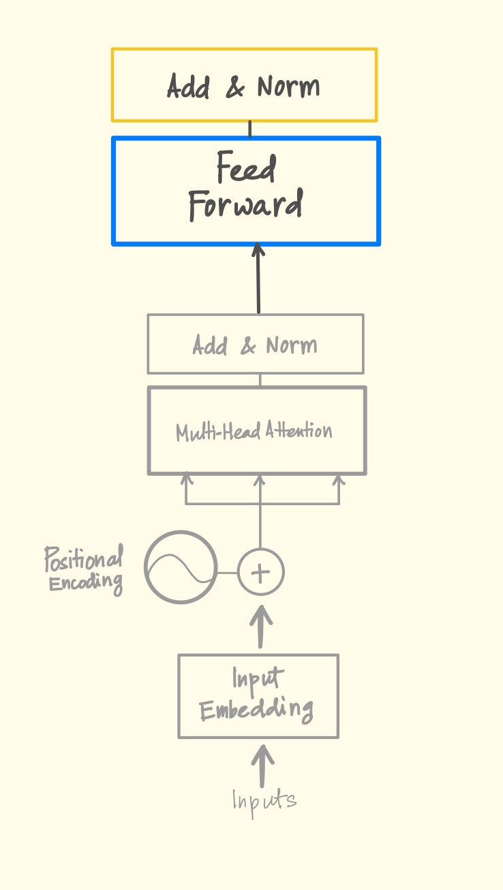
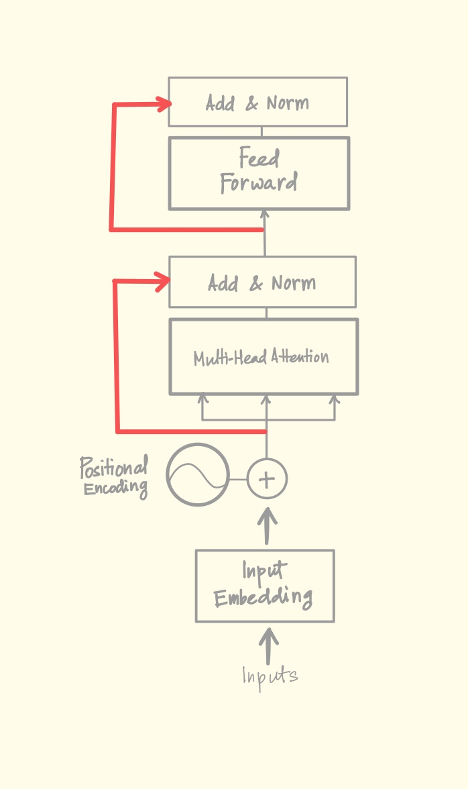
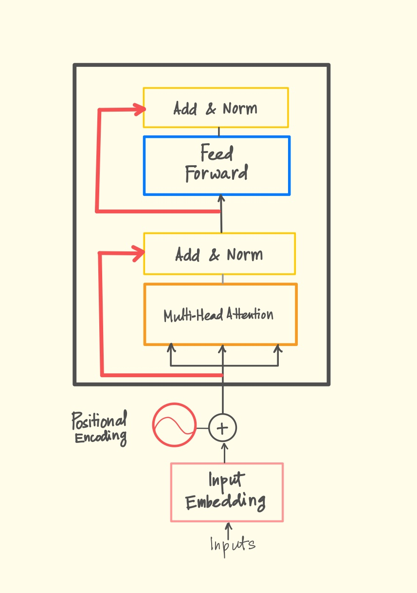
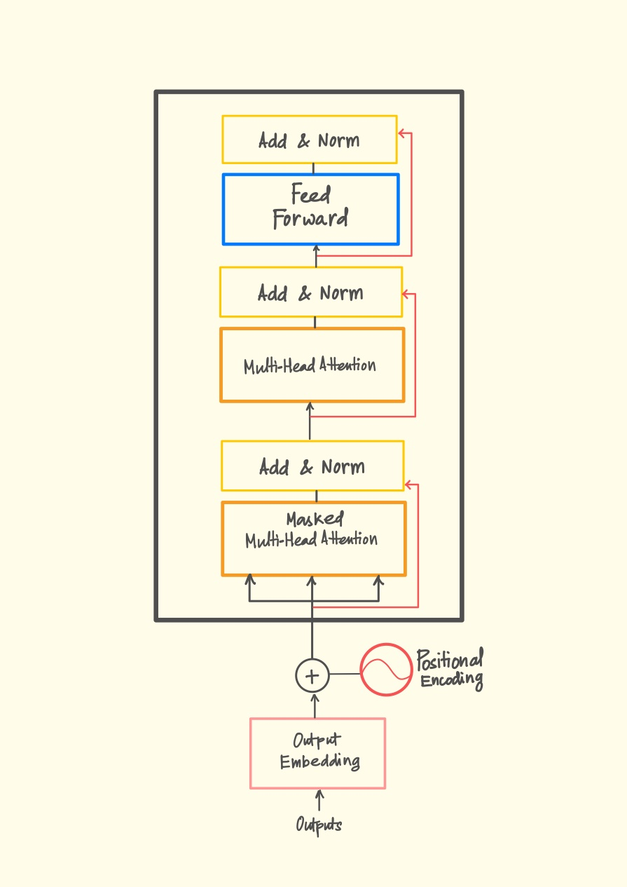
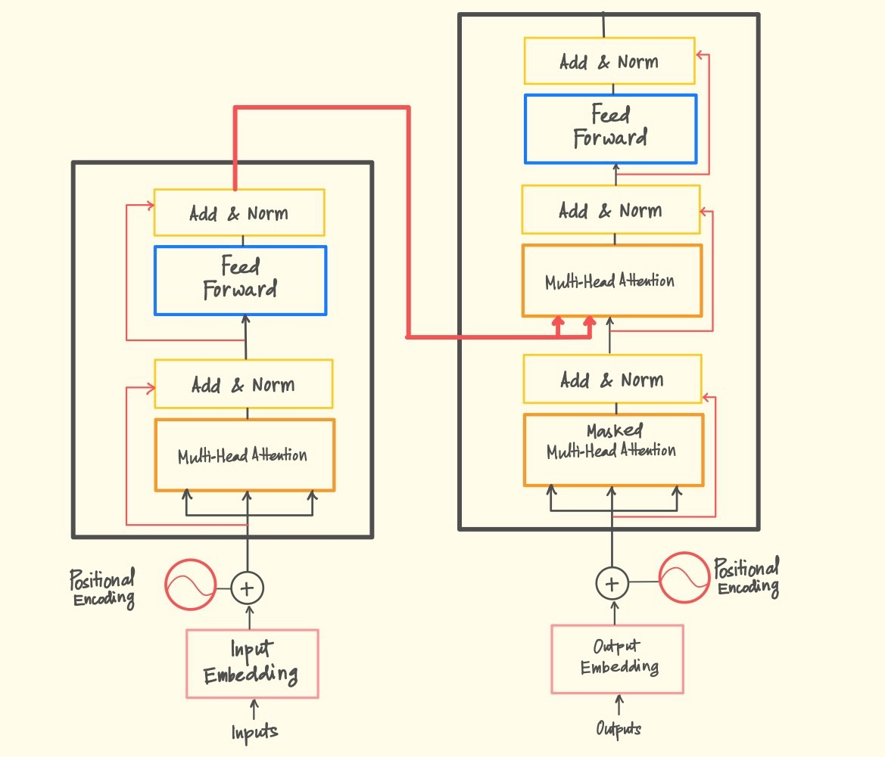
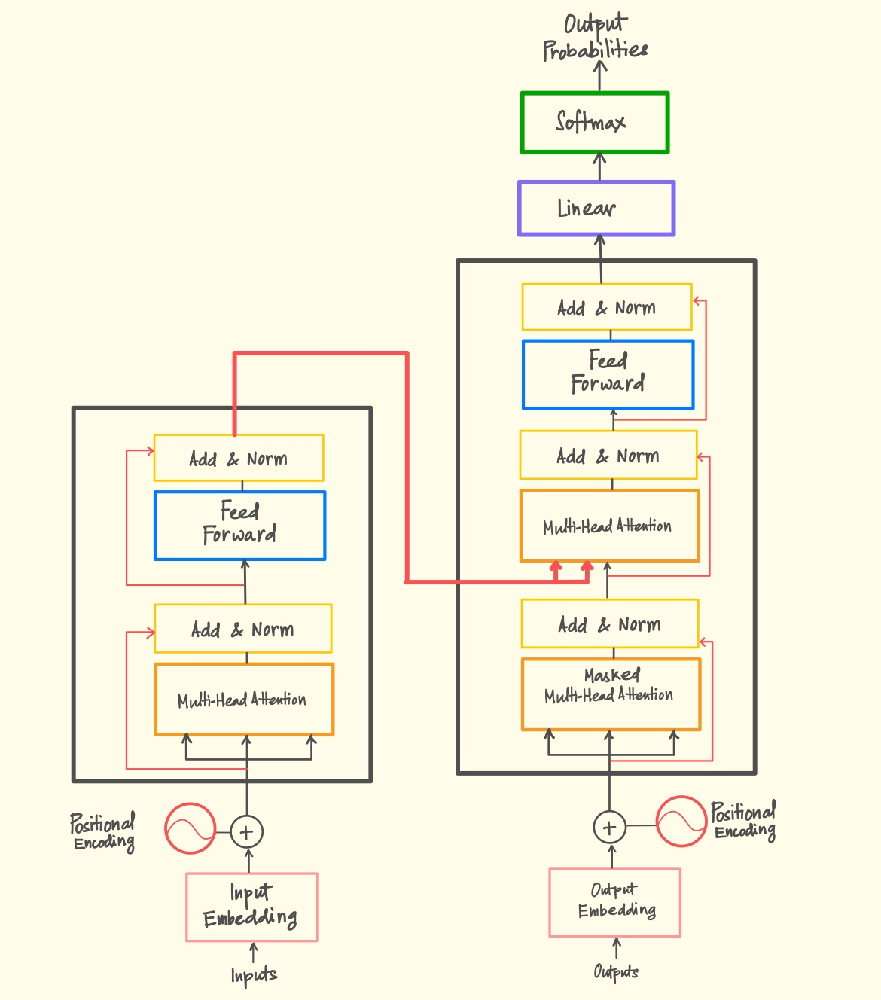

# Source: https://www.k-a.in/transformers.html

Let's break down the entire transformer code.
Line.
By.
Line.

> attention paper for reference.
  
⠀⠀  
⠀⠀
⠀⢀⠤⣀⣀⣴⣶⣔⢂  
⠀⠀
⠀⠸⠀⠀⠀⠻⠿⢿⣿⡇⠀  
⠀⠀
⢀⣸⠀⡀⠀⠀⠀⢠⠀⣗⡂  
⠀⠀
⠀⢚⣄⡁⠀⠛⠀⢀⡰⢷  
⠀⠀

We use PyTorch!

## Import Statements

```
import torch
import torch.nn as nn
import math
```

> importing PyTorch for deep learning, neural network modules, and math ops.

## Input Embeddings Class



```
class InputEmbeddings(nn.Module):
```

> defines a class for embedding input tokens into vectors, inheriting from PyTorch Module class.

```
def __init__(self, d_model:int, vocab_size:int):
```

> constructor takes model dimension and vocab size as params.

```
self.d_model = d_model
self.vocab_size = vocab_size
```

> stores the model dim and vocab size as class attributes.

```
self.embedding = nn.Embedding(vocab_size,d_model)
```

> creates an embedding layer that maps token indices to d\_model dimensional vectors.

```
def forward(self,x):
```

> forward pass method that processes input x.

```
return self.embedding(x) * math.sqrt(self.d_model)
```

> applies embedding and multiplies by  $ \sqrt d\_{model} $  to keep variance stable as described in the paper.

## Positional Encoding Class



```
class PositionalEncoding(nn.Module):
```

> class for adding positional information to embeddings.

```
def __init__(self, d_model:int, seq_len:int, dropout:float) -> None:
```

> constructor takes model dimension, maximum sequence length, and dropout rate as params.

```
self.d_model = d_model
self.seq_len = seq_len
```

> stores dimensions as class attributes.

```
self.droput = nn.Dropout(dropout)
```

> creates a dropout layer

```
pe = torch.zeros(seq_len,d_model)
```

> initializes a tensor for positional encodings with zeros.

```
position = torch.arange(0,seq_len,dtype=torch.float).unsqueeze(1)
```

> creates a column vector with position indices from 0 to seq\_len-1.

```
div_term = torch.exp(torch.arange(0,d_model,2).float()*(-math.log(10000.0)/d_model))
```

> create division term for the sinusoidal functions per papers formula.

```
pe[:,0::2] = torch.sin(position*div_term)
```

> apply sine to even indices of the position encoding.

```
pe[:,1::2] = torch.cos(position*div_term)
```

> Applies cosine to odd indices of the position encoding.

```
pe = pe.unsqueeze(0)
```

> adds a batch dimension to the positional encoding.

```
self.register_buffer('pe',pe)
```

> registers the positional encoding tensor as a buffer (persistent state that's not a parameter).

```
def forward(self,x):
```

> forward pass method for input x.

```
x = x + (self.pe[:,:x.shape[1],:]).requires_grad_(False)
```

> adds positional encoding to input, trimmed to match input sequence length, with gradient disabled.

```
return self.dropput(x)
```

> applies dropout to the sum of input and positional encoding.

## Multi-Head Attention Block Class



```
class MultiHeadAttentionBlock(nn.Module):
```

> implements multi-head attention mechanism.

```
def __init__(self,d_model:int,h:int,dropout:float)->None:
```

> constructor with model dimension, number of heads, and dropout rate.

```
self.d_model = d_model
self.h = h
```

> stores dimensions as attributes.

```
assert d_model % h == 0, "d_model is not divisible by h"
```

> ensures model dimension is divisible by number of heads.

```
self.d_k = d_model // h
```

> dimension per head.

```
self.w_q = nn.Linear(d_model,d_model,bias=False)
```

> linear projection for query vectors without bias.

```
self.w_k = nn.Linear(d_model,d_model,bias=False)
```

> linear projection for key vectors without bias.

```
self.w_v = nn.Linear(d_model,d_model,bias=False)
```

> linear projection for value vectors without bias.

```
self.w_o = nn.Linear(d_model,d_model,bias=False)
```

> output linear projection without bias.

```
self.dropout = nn.Dropout(dropout)
```

> dropout layer for regularization.

```
@staticmethod
def attention(query,key,value,mask,dropout:nn.Dropout):
```

> static method implementing scaled dot-product attention.

```
d_k = query.shape[-1]
```

> gets dimension of keys/queries.

```
attention_scores = (query @ key.transpose(-2,-1))/math.sqrt(d_k)
```

> calculates attention scores using matrix multiplication and scaling.

```
if mask is not None:
    attention_scores.masked_fill_(mask==0,-1e9)
```

> applies mask by setting masked positions to negative infinity(very, but not really) values.

```
attention_scores = attention_scores.softmax(dim=-1)
```

> applies softmax to get attention probabilities.

```
if dropout is not None:
    attention_scores = dropout(attention_scores)
```

> applies dropout to attention scores if provided.

```
return (attention_scores @ value), attention_scores
```

> returns weighted values and attention scores.

```
def forward(self,q,k,v,mask):
```

> forward pass with query, key, value inputs and optional mask.

```
query = self.w_q(q)
key = self.w_k(k)
value = self.w_v(v)
```

> applies linear projections to inputs.

```
query = query.view(query.shape[0],query.shape[1],self.h,self.d_k).transpose(1,2)
key = key.view(key.shape[0],key.shape[1],self.h,self.d_k).transpose(1,2)
value = value.view(value.shape[0],value.shape[1],self.h,self.d_k).transpose(1,2)
```

> reshapes and transposes tensors for multi-head processing.

```
x,self.attention_scores = MultiHeadAttentionBlock.attention(query,key,value,mask,self.dropout)
```

> computes attention and stores scores.

```
x = x.transpose(1,2).contiguous().view(x.shape[0],-1,self.h*self.d_k)
```

> reshapes output back to original dimensions.

```
return self.w_o(x)
```

> applies output projection.

## Layer Normalization Class



```
class LayerNormalization(nn.Module):
```

> implements layer normalization for stabilizing network activations.

```
def __init__(self,features: int,eps:float=10**-6) -> None:
```

> constructor with feature count and small epsilon to prevent division by zero.

```
self.eps = eps
```

> stores epsilon as class attribute.

```
self.alpha = nn.Parameter(torch.ones(features))
```

> learnable scaling parameter initialized to ones.

```
self.bias = nn.Parameter(torch.zeros(features))
```

> learnable bias parameter initialized to zeros.

```
def forward(self,x):
```

> forward pass method for input x.

```
mean = x.mean(dim = -1, keepdim = True)
```

> calculates mean across feature dimension.

```
std = x.std(dim = -1, keepdim = True)
```

> calculates standard deviation across feature dimension.

```
return self.alpha * (x-mean)/(std+self.eps) + self.bias
```

> normalizes input, applies scaling and bias.

## Feed Forward Block Class



```
class FeedForwardBlock(nn.Module):
```

> implements the feed-forward network component of transformer.

```
def __init__(self,d_model:int,d_ff:int,dropout:float) -> None:
```

> constructor with model dimension, feed-forward dimension, and dropout rate.

```
self.linear_1 = nn.Linear(d_model,d_ff)
```

> first linear transformation from d\_model to d\_ff dimensions.

```
self.dropout = nn.Dropout(dropout)
```

> dropout layer for regularization.

```
self.linear_2 = nn.Linear(d_ff,d_model)
```

> second linear transformation from d\_ff back to d\_model dimensions.

```
def forward(self,x):
```

> forward pass method for input x.

```
return self.linear_2(self.dropout(torch.relu(self.linear_1(x))))
```

> applies first linear transformation, ReLU activation, dropout, then second linear transformation.

## Residual Connection Class



```
class ResidualConnection(nn.Module):
```

> implements residual connections with normalization.

```
def __init__(self,features: int,dropout:float) -> None:
```

> constructor with feature count and dropout rate.

```
self.dropout = nn.Dropout(dropout)
```

> dropout layer for regularization.

```
self.norm = LayerNormalization(features)
```

> layer normalization.

```
def forward(self,x,sublayer):
```

> forward pass with input and sublayer function.

```
return x + self.dropout(sublayer(self.norm(x)))
```

> applies layer norm, sublayer, dropout, and residual connection.

## Encoder Block Class



```
class EncoderBlock(nn.Module):
```

> implements a single encoder block.

```
def __init__(self, features: int, self_attention_block: MultiHeadAttentionBlock, feed_forward_block: FeedForwardBlock, dropout: float) -> None:
```

> constructor with features, attention block, feed-forward block, and dropout.

```
self.self_attention_block = self_attention_block
self.feed_forward_block = feed_forward_block
```

> stores network components.

```
self.residual_connections = nn.ModuleList([ResidualConnection(features,dropout) for _ in range(2)])
```

> creates two residual connections for attention and feed-forward.

```
def forward(self,x,src_mask):
```

> forward pass with input and source mask.

```
x = self.residual_connections[0](x,lambda x: self.self_attention_block(x,x,x,src_mask))
```

> applies self-attention with residual connection.

```
x = self.residual_connections[1](x, self.feed_forward_block)
```

> applies feed-forward with residual connection.

```
return x
```

> returns processed tensor.

## Encoder Class

```
class Encoder(nn.Module):
```

> implements the full encoder with multiple blocks.

```
def __init__(self, features: int, layers: nn.ModuleList) -> None:
```

> constructor with feature count and list of encoder blocks.

```
self.layers = layers
```

> stores encoder blocks.

```
self.norm = LayerNormalization(features)
```

> creates final normalization layer.

```
def forward(self,x,mask):
```

> forward pass with input and mask.

```
for layer in self.layers:
    x = layer(x, mask)
```

> processes input through each encoder block.

```
return self.norm(x)
```

> applies final normalization.

## Decoder Block Class



```
class DecoderBlock(nn.Module):
```

> implements a single decoder block.

```
def __init__(self,features: int,self_attention_block: MultiHeadAttentionBlock, cross_attention_block: MultiHeadAttentionBlock, feed_forward_block: FeedForwardBlock, dropout: float) -> None:
```

> constructor with features, self-attention, cross-attention, feed-forward, and dropout.

```
self.self_attention_block = self_attention_block
self.cross_attention_block = cross_attention_block
self.feed_forward_block = feed_forward_block
```

> stores network components.

```
self.residual_connection = nn.ModuleList([ResidualConnection(features,dropout) for _ in range(3)])
```

> creates three residual connections.

```
def forward(self,x,encoder_output,src_mask,tgt_mask):
```

> forward pass with input, encoder output, source mask, and target mask.

```
x = self.residual_connection[0](x,lambda x: self.self_attention_block(x,x,x,tgt_mask))
```

> applies masked self-attention with residual connection.

```
x = self.residual_connection[1](x,lambda x: self.cross_attention_block(x, encoder_output, encoder_output, src_mask))
```

> applies cross-attention with encoder output and residual connection.

```
x = self.residual_connection[2](x, self.feed_forward_block)
```

> applies feed-forward with residual connection.

```
return x
```

> returns processed tensor.

## Decoder Class

```
class Decoder(nn.Module):
```

> implements full decoder with multiple blocks.

```
def __init__(self,features: int, layers: nn.ModuleList) -> None:
```

> constructor with feature count and list of decoder blocks.

```
self.layers = layers
```

> stores decoder blocks.

```
self.norm = LayerNormalization(features)
```

> creates final normalization layer.

```
def forward(self, x, encoder_output,src_mask,tgt_mask):
```

> forward pass with input, encoder output, source mask, and target mask.

```
for layer in self.layers:
    x = layer(x,encoder_output,src_mask,tgt_mask)
```

> processes input through each decoder block.

```
return self.norm(x)
```

> applies final normalization.

## Projection Layer Class

```
class ProjectionLayer(nn.Module):
```

> projects decoder output to vocabulary size.

```
def __init__(self, d_model, vocab_size) -> None:
```

> constructor with model dimension and vocabulary size.

```
self.proj = nn.Linear(d_model,vocab_size)
```

> creates linear projection layer.

```
def forward(self,x):
```

> forward pass with input.

```
return self.proj(x)
```

> applies projection to vocabulary space.

## Transformer Class



```
class Transformer(nn.Module):
```

> main transformer model combining all components.

```
def __init__(self, encoder: Encoder, decoder: Decoder, src_embed: InputEmbeddings, tgt_embed: InputEmbeddings, src_pos: PositionalEncoding, tgt_pos: PositionalEncoding, projection_layer: ProjectionLayer) -> None:
```

> constructor taking all major components.

```
self.encoder = encoder
self.decoder = decoder
self.src_embed = src_embed
self.tgt_embed = tgt_embed
self.src_pos = src_pos
self.tgt_pos = tgt_pos
self.projection_layer = projection_layer
```

> stores all components as attributes.

```
def encode(self, src, src_mask):
```

> method to encode source sequence.

```
src = self.src_embed(src)
```

> embeds source tokens.

```
src = self.src_pos(src)
```

> adds positional encoding.

```
return self.encoder(src, src_mask)
```

> processes through encoder.

```
def decode(self, encoder_output: torch.Tensor,src_mask: torch.Tensor,tgt: torch.Tensor,tgt_mask: torch.Tensor):
```

> method to decode target sequence.

```
tgt = self.tgt_embed(tgt)
```

> embeds target tokens.

```
tgt = self.tgt_pos(tgt)
```

> adds positional encoding.

```
return self.decoder(tgt,encoder_output,src_mask,tgt_mask)
```

> processes through decoder.

```
def project(self,x):
```

> projects decoder output to vocabulary.

```
return self.projection_layer(x)
```

> applies projection layer.

## Transformer Builder Function



```
def build_transformer(src_vocab_size: int, tgt_vocab_size: int, src_seq_len: int, tgt_seq_len: int, d_model: int = 512, N: int = 6, h: int = 8, dropout: float = 0.1, d_ff: int = 2048) -> Transformer:
```

> function to construct a complete transformer with default hyperparameters.

```
src_embed = InputEmbeddings(d_model,src_vocab_size)
tgt_embed = InputEmbeddings(d_model,tgt_vocab_size)
```

> creates embedding layers.

```
src_pos = PositionalEncoding(d_model,src_seq_len,dropout)
tgt_pos = PositionalEncoding(d_model,tgt_seq_len,dropout)
```

> creates positional encoding layers.

```
encoder_blocks = []
```

> initializes list for encoder blocks.

```
for _ in range(N):
    encoder_self_attention_block = MultiHeadAttentionBlock(d_model,h,dropout)
    feed_forward_block = FeedForwardBlock(d_model,d_ff,dropout)
    encoder_block = EncoderBlock(d_model,encoder_self_attention_block, feed_forward_block,dropout)
    encoder_blocks.append(encoder_block)
```

> creates N encoder blocks with attention and feed-forward components.

```
decoder_blocks = []
```

> initializes list for decoder blocks.

```
for _ in range(N):
    decoder_self_attention_block = MultiHeadAttentionBlock(d_model, h, dropout)
    decoder_cross_attention_block = MultiHeadAttentionBlock(d_model,h,dropout)
    feed_forward_block = FeedForwardBlock(d_model,d_ff,dropout)
    decoder_block = DecoderBlock(d_model,decoder_self_attention_block,decoder_cross_attention_block,feed_forward_block,dropout)
    decoder_blocks.append(decoder_block)
```

> creates N decoder blocks with self-attention, cross-attention, and feed-forward components.

```
encoder = Encoder(d_model,nn.ModuleList(encoder_blocks))
decoder = Decoder(d_model,nn.ModuleList(decoder_blocks))
```

> creates encoder and decoder with respective blocks.

```
projection_layer = ProjectionLayer(d_model,tgt_vocab_size)
```

> creates output projection layer.

```
transformer = Transformer(encoder,decoder,src_embed,tgt_embed,src_pos,tgt_pos,projection_layer)
```

> assembles complete transformer.

```
for p in transformer.parameters():
    if p.dim()>1:
        nn.init.xavier_uniform_(p)
```

> initializes parameters with dimension > 1 using Xavier uniform initialization.

```
return transformer
```

> returns assembled transformer model.

⠀⠀  
⠀⠀
⠀⠀⠀⠀⠀⠀⠀⠀⣀⣀⣠⣤⣤⣤⣤⣤⣤⣄⣀⣀⡀⠀⠀⠀⠀⠀⠀⠀  
⠀⠀
⣶⣶⣶⣶⡄⢰⣾⣿⣿⣿⣿⣿⣿⣿⣿⣿⣿⣿⣿⣿⣿⣿⡆⢠⣴⣶⣶⣶  
⠀⠀
⢹⣿⡿⣿⣷⠀⠿⣿⣿⣿⣦⣀⠀⠀⠀⠀⣀⣴⣿⣿⣿⠿⠀⣾⣿⢿⣿⡏  
⠀⠀
⠘⣿⣷⣬⡙⠿⣦⣌⡙⠿⣿⣿⣷⣦⣴⣾⣿⣿⠿⢋⣡⣴⠿⢋⣥⣾⣿⠃  
⠀⠀
⠀⢻⣿⣌⠛⢷⣌⡙⢿⣶⡌⠙⢿⣿⣿⠿⠋⢡⣶⡿⢋⣡⡶⠛⣡⣿⡟⠀  
⠀⠀
⠀⠘⠿⣿⣿⣦⣌⠛⢾⣿⣇⠸⣷⣌⣡⣶⡇⣸⣿⡷⠛⣡⣴⣿⣿⠿⠃⠀  
⠀⠀
⠀⠀⢠⣌⠻⢿⣿⣿⣦⣿⣿⠀⣿⣿⣿⣿⠀⣿⣿⣴⣿⣿⡿⠟⣡⡄⠀⠀  
⠀⠀
⠀⠀⢸⣿⣷⠀⠀⠉⠉⠉⠛⠀⣿⣿⣿⣿⠀⠛⠉⠉⠉⠀⠀⣾⣿⡇⠀⠀  
⠀⠀
⠀⠀⢸⣿⣿⣿⣦⠀⢠⣴⣾⡇⢸⣿⣿⣿⠀⣷⣦⡄⠀⣴⣿⣿⣿⡇⠀⠀  
⠀⠀
⠀⠀⠀⣿⣿⣿⣿⠀⢸⣿⣿⡇⢸⣿⣿⣿⠀⣿⣿⡇⠀⣿⣿⣿⣿⠁⠀⠀  
⠀
⠀⠀⠀⣿⣿⣿⣿⠀⢸⣿⣿⡇⢾⣿⣿⣿⠀⣿⣿⡇⠀⣿⣿⣿⣿⠀⠀⠀  
⠀⠀
⠀⠀⠀⠻⢿⣿⣿⠀⢸⣿⣿⣷⣶⣶⣶⣶⣶⣿⣿⡇⠀⣿⣿⣿⠟⠀⠀⠀  
⠀⠀
⠀⠀⠀⠀⠀⠙⢿⠀⢸⣿⣿⠋⣉⣉⣉⣉⠉⣿⣿⡇⠀⡿⠋⠀⠀⠀⠀⠀  
⠀⠀
⠀⠀⠀⠀⠀⠀⠀⠀⠸⣿⠃⣼⣿⣿⣿⣿⣧⠘⣿⠇⠀⠀⠀⠀⠀⠀⠀⠀  
⠀⠀
⠀⠀⠀⠀⠀⠀⠀⠀⠀⠈⠘⠛⠛⠛⠛⠛⠛⠂⠀⠀⠀⠀⠀⠀⠀⠀⠀⠀  
⠀⠀

  


---

> It's time we train the Transformer.